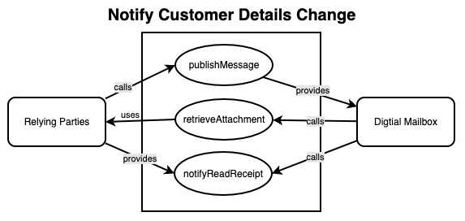
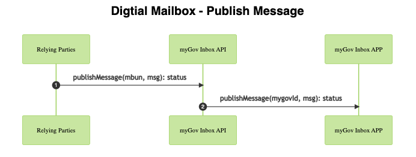
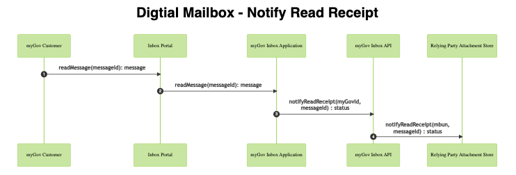

## Overview

The myGov Inbox is a centralized online communication platform that enables member services to interact with their customers directly through myGov. It provides a secure and user-friendly interface where customers can manage all their communications with participating member services in one convenient location. The Inbox is designed to streamline communication processes, enhance customer experience, and ensure data privacy and security.

### Purpose
This specification defines the integration requirements and behaviour of the myGov Digital Mail member service interfaces.

### Scope
This document specifies the

1. Service Description
1. Service Mediation used and supporting values
1. Header structure
1. Transformation details if any

### Out of Scope
Items explicitly not included in the scope of this document include:

1. Non ESB systems
2. Business service implementation details

### Audience
This document is intended for:

| Name                  | Role                                          |
|:----------------------|:----------------------------------------------|
| myGov Member Services | Member Services that are on boarding to myGov |
| myGov Inbox           | Developers of myGov Inbox                     |

### Actors
This document describes various criteria and they are categorised by the using actors and artefacts.

The actors used in this document are:

| Actor          | Details                                                                                                                                |
|:---------------|:---------------------------------------------------------------------------------------------------------------------------------------|
| Member Service | A member of myGov that provides services to consumers. A member service<br/>can act as a web service client or a web service provider. |
| RF/ myGov ESB  | Reliance Framework Enterprise Service Bus. Used to manage the <br/>client / server interactions to/ from myGov. |
| Inbox          | myGov Inbox |

## Service Details

## Use Cases
Digitalmail Use cases.



### UC-01: Publish Message

#### UC-01: Description
This service enables member services to send messages directly to their customer's myGov Inbox. These messages can be viewed by customers who have linked their myGov accounts to the corresponding member service.

#### UC-01: Actors
1. Issuing Member Service
1. myGov Inbox
1. Customer

#### UC-01: Scenarios
1. A Member Service issues a message for one of their customers, which is published to the customer's myGov account and is displayed via myGov Inbox
1. myGov Inbox sends an SMS or email notification to the customer, advising them that a new message has been received and is available to be viewed.

#### UC-01: Service Operation Details

| Operation Attribute | Attribute Value |
|:--------------------|:----------------|
| Operation Name      | publishMessage  |
| Service Provider    | myGov Inbox     |
| Service Consumers   | Member Services |
| ESB Instance        | External        |
| AGAF Rating         | 3               |
| SOAP Version        | 1.2             |
| Transport           | HTTP            |
| Authorised Roles    | N / A           |
| Authorised Groups   | N / A           |

#### UC-01: Service Details

| Operation Attribute  | Attribute Value                                                                                    |
|:---------------------|:---------------------------------------------------------------------------------------------------|
| Request Action       | `http://ns.services.my.gov.au/inbox/virtual/svc/2013/09/07/publishmessage`                         |
| Response Action      | `http://ns.services.my.gov.au/inbox/virtual/svc/2013/09/07/publishmessageresponse`                 |
| Authentication       | Signed Security                                                                                    |
| Msg Elements To Sign | Timestamp, MessageID, Product, Soap Body, Audit, Subject Id                                        |
| TEST Endpoint        | `https://test.services.my.gov.au/mgvstream0/pext/inbox/publishmessage/virtual/endpoint/2013/09/07` |
| Production Endpoint  | `https://services.my.gov.au/pext/inbox/publishmessage/virtual/endpoint/2013/09/07`                 |

#### UC-01: Sequence process
Publish Message Use-case Sequence diagram



#### UC-01: Attributes

| Name                   | Format / Value                   | Mandatory | Description                                                                                                                          |
|:-----------------------|:---------------------------------|:----------|:-------------------------------------------------------------------------------------------------------------------------------------|
| memberServiceMessageId | String (40)                      | Yes       | Unique id of the message. Id must<br/>be unique within the Member<br/>Service.                                                       |
| memberServiceId        | String (12)                      | Yes       | The Member Service acronym<br/>e.g. ATO, CLK, CSP, MCA. <br/>Refer to [Appendix-Agency Codes](#agency-codes)<br/>for valid values.   |
| messageType            | String (40)                      | Yes       | The type of the message. Refer to<br/>[Appendix - Message Codes](#message-codes)<br/>for valid values.                               |
| messagePriority        | "urgent", <br/>"normal",<br/>"non-urgent" | Yes | The importance of the message                                                                                                     |
| messageSubject         | String (250)                     | Yes       | Subject of the message                                                                                                               |
| messageExpiryDate      | yyyy-MM-dd                       | No        | Set by the Member Service to<br/>indicate when a message can no<br/>longer be viewed. If not set,<br/>messages archived according to<br/>myGov rules |
| memberServiceDateTime  | yyyy-MM-ddT<br/>HH:mm:ss.SSSZ    | Yes       | Either the date time the <br/>message was sent by the Member<br/>Service or generated at the<br/>Member Service.                     |
| onBehalfOf             | String (100)                     | No        | Name of the client the message<br/>was sent on behalf of                                                                             |
| alertSentIndicator     | "Y", "N"                         | No        | Used when the Member Service has<br/>already sent an SMS / email<br/>notification                                                 |
| readReceiptRequired    | "Y", "N"                         | No        | Used when the Member Service wants<br/>to be notified when the<br/>customer reads the message for<br/>the first time.            |
| messageRead            | [messageRead](#publishmessagemessageread) | No| Details about when the message was<br/>read in the Member Service before<br/>sending to myGov, if applicable                        |
| messageBody            | String (2048)                    | No        | Text body of the message                                                                                                             |
| attachments            | [attachments](#publishmessageattachments) | No | Details about the attachments of <br/>this Message                                                                                 |
| relatedURLs            | [relatedURLs](#publishmessagerelatedurls) | No | Details about the urls related to<br/>this Message                                                                                 |
| dynamicMessageBody     | "Y", "N"                         | No        | Dynamic Message content Flag Things<br/>to discuss 1. We need to finalize<br/>the business rules as to what should<br/>happen if a message contains both<br/>and dynamicMessageBody Flag? |

##### publishMessage.messageRead

| Name          | Format <br/>Value                                   | Mandatory | Description                                                                                             |
|:--------------|:----------------------------------------------------|:----------|:--------------------------------------------------------------------------------------------------------|
| readIndicator | "Y", "N"                                            | Yes       | Used by the Member Service when <br/>the communication should be marked<br/>as `Read` in myGov Inbox immediately |
| readDateTime  | yyyy-MM-ddT<br/>HH:mm:ss.SSSZ<br/>(2011-02-23T11:24:20.100Z) | Yes| The date time which the message<br/>was first read at the Member Service.                                   |

##### publishMessage.attachments

| Name                | Format <br/>Value            | Mandatory | Description                                                                                                      |
|:--------------------|:--------------------------|:----------|:-----------------------------------------------------------------------------------------------------------------|
| primaryAttachmentId | String(40)                | Yes       | The attachmentId of the primary attachment.<br/>Must match one of memberServiceAttachmentIds<br/> in the attachment array |
| attachment          | [attachment](#publishmessageattachmentsattachment) | Yes       | Metadata information on the attachment.<br/>Repeats 1 or more times.                        |

##### publishMessage.attachments.attachment

| Name                      | Format <br/>Value | Mandatory | Description                                                                                                                     |
|:--------------------------|:---------------|:----------|:--------------------------------------------------------------------------------------------------------------------------------|
| memberServiceAttachmentId | String (40)    | Yes       | Unique id of the attachment. Id<br/>must be unique within the Member<br/>Service or unique in conjunction<br/>with memberServiceMessageId.  |
| displayPosition           | Integer        | Yes       | The order in which the attachment<br/>is to be displayed. Starts at 1.                                                              |
| attachmentName            | String (100)   | Yes       | The actual name of the attachment.                                                                                              |
| attachmentTitle           | String (100)   | Yes       | The display name of the attachment.<br/>May be the same as attachmentName.<br/>Used for display purposes only                           |
| attachmentSize            | Integer        | Yes       | The size of the attachment, in bytes.<br/>Must be greater than 0 and must<br/>not exceed 4MB.                                           |
| mimeType                  | String (100)   | Yes       | Also known as Media Type of the<br/>attachment. Must be known and<br/>supported by myGov customers.<br/>Refer to [Appendix - Message Type]<br/>(#messagetype) for valid values. |

##### publishMessage.relatedURLs

| Name            | Format <br/>Value | Mandatory | Description                                                            |
|:----------------|:---------------|:----------|:-----------------------------------------------------------------------|
| urlTitle        | String(100)    | Yes       | The display name of the url. Used for display<br/>purposes only            |
| url             | String(2048)   | Yes       | The fully qualified url of the link                                    |
| displayPosition | Integer        | Yes       | The position (order) in which the url is to be<br/>displayed. Starts at 1. |

##### publishMessage.dynamicMessageBody

| Name     | Format<br/>Value | Mandatory | Description                                                                                                                                |
|:---------|:---------------|:----------|:-------------------------------------------------------------------------------------------------------------------------------------------|
| Endpoint | url            | Yes       | Dynamic Message URL to retrieve the dynamic message<br/>content from the member service ? relative url or<br/>complete url ? API not SOAP endpoint |

##### publishMessageResponse

| Name                 | Format <br/>Value                            | Mandatory | Description                                                                                                                 |
|:---------------------|:----------------------------------------- |:----------|:----------------------------------------------------------------------------------------------------------------------------|
| publishMessageResult | 'SUCCESS',<br/>'FAILED'                       | Yes       | Whether or not the request<br/>succeeded. Note that errors that<br/>prevent the service executing<br/>are to be returned as SOAP Faults |
| serviceMessagesType  | [serviceMessageType](#servicemessagetype) | No        | Contains Information around<br/>the processing of the web<br/>service request                                                       |

### UC-02: Retrieve Attachment

#### UC-02: Description
This service allows myGov customers to view attachments for messages passed to myGov Inbox by participating member services. Attachments to messages are not stored in the myGov database - they remain in the member service database and are only displayed via myGov Inbox when the myGov user chooses to view them while reading the related message.

#### UC-02: Actors
1. Issuing member service
1. myGov Inbox
1. Customer

#### UC-02: Scenarios
1. A myGov customer opens a message from a linked member service via myGov Inbox, and chooses to view an attachment that is associated with that message.
1. myGov Inbox retrieves the attachment from the relevant member service and displays it to the customer.

#### UC-02: Service Operation Details
| Operation Attribute | Attribute Value    |
|:--------------------|:-------------------|
| Operation Name      | retrieveAttachment |
| Service Provider    | Member Services    |
| Service Consumers   | myGov Inbox        |
| ESB Instance        | External           |
| AGAF Rating         | 3                  |
| SOAP Version        | 1.2                |
| Transport           | HTTP               |
| Authorised Roles    | N / A              |
| Authorised Groups   | N / A              |

#### UC-02: Service Details

| Operation Attribute    | Attribute Value                                                                                   |
|:-----------------------|:--------------------------------------------------------------------------------------------------|
| Request Action         | `http://ns.services.my.gov.au/inbox/memberservice/svc/2013/09/07/retrieveattachment`              |
| Response Action        | `http://ns.services.my.gov.au/inbox/memberservice/svc/2013/09/07/retrieveattachmentresponse`      |
| Authentication         | Signed Security                                                                                   |
| Msg Elements To Signed | Timestamp, MessageID, Product, Soap Body, Audit, Subject Id,<br/>ServiceProvider                  |
| TEST Endpoint          | `https://member_service_test_hostname/inbox/retrieveattachment/memberservice/endpoint/2013/09/07` |
| Production Endpoint    | `https://member_service_prod_hostname/inbox/retrieveattachment/memberservice/endpoint/2013/09/07` |

#### UC-02: Sequence process
Retrieve Attachment Use-case sequence diagram.


#### UC-02: Attributes

| Name                      | Format / Value           | Mandatory | Description                                                                                                                                   |
|:--------------------------|:-------------------------|:----------|:----------------------------------------------------------------------------------------------------------------------------------------------|
| memberService<br/>AttachmentId | String (40)         | Yes       | Unique id of the attachment. Used by the<br/>Member Service to retrieve attachments. Id<br/>must be unique within the Member Service or<br/>in conjunction with memberServiceMessageId |
| memberService<br/>MessageId| String (40)              | Yes      | Unique id of the message. Id must be unique<br/>within the Member Service                                                                     |
| memberService<br/>DateTime | yyyy-MM-dd<br/>THH:mm:ss.SSSZ | Yes | Is either the date time the message was<br/>sent by the Member Service or generated<br/>at the Member Service. Passed in as part of<br/>publishMessage |
| mimeType                  | String (100)             | Yes       | Media Type of the attachment. Must be<br/>known and supported by myGov.                                                                       |

##### retrieveAttachmentResponse

| Name                     | Format <br/> Value                                        | Mandatory | Description                                                                                                                 |
|:-------------------------|:------------------------------------------------------|:----------|:----------------------------------------------------------------------------------------------------------------------------|
| retrieveAttachment<br/>Result | 'SUCCESS',<br/>'FAILED'                          | Yes       | Whether or not the request succeeded.<br/>Note that errors that prevent the<br/>service executing are to be returned<br/> as SOAP Faults |
| attachmentSize           | Integer                                               | Yes       | The size of the attachment in bytes.<br/>Must not exceed 4MB                                                                 |
| attachment<br/>PageCount | Integer                                               | No        | The number of pages in the attachment                                                                                        |
| attachment<br/>Response  | [attachment<br/>Response](#retrieveattachmentresponseattachmentresponse)| No | Contains the mine type as well as the<br/>reference to the actual MTOM attachment                               |
| service<br/>MessagesType | [service<br/>MessageType](#servicemessagetype)        | No        | Contains Information around the<br/>processing of the web service request                                                    |

##### retrieveAttachmentResponse.attachmentResponse

| Name         | Format / Value | Mandatory | Description                            |
|:-------------|:---------------|:----------|:---------------------------------------|
| @contentType | String         | Yes       | The mime/ media type of the attachment |
| Include      | String         | Yes       | Contains the href of the attachment    |

### UC-03: Notify Read Receipt

#### UC-03: Description
This service allows myGov to pass a 'read receipt' to the relevant member service, when a message is deemed to have been 'read' in myGov Inbox and the issuing member service requested a read receipt when passing the message to myGov.

#### UC-03: Actors
1. Issuing member service
1. myGov Inbox
1. Customer

#### UC-03: Scenarios
1. A myGov customer opens a message from a linked member service via myGov Inbox, and the member service requested a read receipt when passing the message to myGov
1. In either scenario, a read receipt is generated by myGov and passed to the issuing member service.

#### UC-03: Service Operation Details

| Operation Attribute | Attribute Value |
|:--------------------|:----------------|
| Service Provider    | Member Services |
| Service Consumers   | myGov Inbox     |
| ESB Instance        | External        |
| AGAF Rating         | 3               |
| SOAP Version        | 1.2             |
| Transport           | HTTP            |
| Authorised Roles    | N / A           |
| Authorised Groups   | N / A           |

#### UC-03: Service Details

| Operation Attribute    | Attribute Value                                                                                                     |
|:-----------------------|:--------------------------------------------------------------------------------------------------------------------|
| Request Action         | `http://ns.services.my.gov.au/inbox/Memberservice/svc/2016/12/03/notifyreadreceipt`                                 |
| Response Action        | `http://ns.services.my.gov.au/inbox/Memberservice/svc/2016/12/03/notifyreadreceiptresponse`                         |
| Authentication         | Signed Security                                                                                                     |
| Msg Elements<br/>To Signed | Timestamp, MessageID, Product, Soap Body, Audit, Subject Id                                                     |
| TEST Endpoint          | `https://<member_service_test_hostname>/inbox/notifyreadreceipt/memberservice/endpoint/2016/12/03` |
| Production<br/>Endpoint| `https://<member_service_prod_hostname>/inbox/notifyreadreceipt/memberservice/endpoint/2016/12/03` |

#### UC-03: Sequence process
Notify Read Receipt Use-case sequence diagram.



#### UC-03: Attributes

| Name        | Format / Value                        | Mandatory | Description |
|:------------|:--------------------------------------|:----------|:------------|
| readReceipt | [readReceipt](#notifyreadreceiptreadreceipt)  1 or many | Yes| |

##### notifyReadReceipt.readReceipt

| Name                       | Format <br/>Value        | Mandatory | Description                                                                                                                          |
|:---------------------------|:-------------------------|:----------|:-------------------------------------------------------------------------------------------------------------------------------------|
| relyingParty<br/>MessageId | String (40)              | Yes       |                                                                                                                                      |
| messageRead<br/>DateTime   | yyyy-MM-dd<br/>THH:mm:ss.SSSZ | Yes  |                                                                                                                                      |
| messageRead<br/>Channel    | Enum                     | Yes       | Possible values ACCESSED - The message was<br/>Read in myGov Inbox FORWARDED - The<br/>message was forwarded to a third<br/>party mail provider. |
| messageRead<br/>ByUsername | String (100)             | No        |                                                                                                                                      |

##### notifyReadReceiptResponse

| Name                    | Format <br/>Value                              | Mandatory | Description                                                           |
|:------------------------|:-----------------------------------------------|:----------|:----------------------------------------------------------------------|
| notifyRead<br/>ReceiptResult | 'SUCCESS',<br/>'FAILED'                   | Yes       |                                                                       |
| service<br/>MessagesType     | [serviceMessageType](#servicemessagetype) | No        | Contains Information around the<br/>processing of the web service request |

## Common Data Type

### WSA

| Name      | Format / Value                                 | Mandatory | Description                                                                                                                           |
|:----------|:-----------------------------------------------|:----------|:--------------------------------------------------------------------------------------------------------------------------------------|
| to        | `http://www.w3.org/2005/08/addressing/anonymous`| Yes      | WSA Endpoint                                                                                                                          |
| messageID | UUID                                           | Yes       | Unique Message ID to identify<br/>an individual message. myGov<br/>will use uuid format for<br/>messageID. Member Services can<br/>use either format. |
| action    | Uri                                            | Yes       | Value that indicates the<br/>semantics of the message as<br/>well as the service to be<br/>called                                     |
| relatesTo | UUID                                           | Yes       | Contains the Unique ID that<br/>is the MessageID of the<br/>request                                                                           |

### Product

| Name           | Format / Value              | Mandatory | Description                                                                                              |
|:---------------|:----------------------------|:----------|:---------------------------------------------------------------------------------------------------------|
| organisation   | [organisation](#productorganisation) | Yes       | Details of the organisation the request<br/>originated from                                     |
| productName    | String                      | Yes       | The name of the product or application as<br/>it is known externally. For myGov this is<br/>"myGov Application".|
| productVersion | vx.x (v1.0)                 | Yes       | Version of the software product. For myGov<br/>this is "1.1".                                            |
| platform       | String                      | Yes       | Platform/ operating system that the product<br/>or application runs on                                   |

### product.organisation

| Name      | Format / Value                                      | Mandatory | Description                                                          |
|:----------|:----------------------------------------------------|:----------|:---------------------------------------------------------------------|
| Qualifier | `http://ns.servcies.my.gov.au/qualifier/organisation` | Yes     | The organisation or agency<br/>where the request<br/>originated from       |
| Id        | string                                              | Yes       | The id of the organisation.<br/>To be assigned in <br/>conjunction with myGov |

### subjectId

| Name      | Format / Value | Mandatory | Description                 |
|:----------|:---------------|:----------|:----------------------------|
| Qualifier | uri            | Yes       | The uri representing the id |
| Id        | string         | Yes       | myGov or Member Service id  |

### audit

| Name             | Format / Value                                                | Mandatory | Description                                                |
|:-----------------|:--------------------------------------------------------------|:----------|:-----------------------------------------------------------|
| User             | [user](#audituser)                                            |           |                                                            |
| globalSessionKey | URN:UUID format<br/>`urn:uuid:a8a22f19-67ee-4d5f-8811-99937794f6d1` | Yes       | A universally unique<br/>Identifier prepended<br/>with 'urn:uuid' |

### audit.user

| Name     | Format / Value              | Mandatory | Description                                                             |
|:---------|:----------------------------|:----------|:------------------------------------------------------------------------|
| userType | "USER" <br/>"APPU" <br/>"STAFF" | Yes   | Identifies if the transaction was triggered<br/>by a user or an application |
| userId   | [userId](#audituseruserid)  |           |                                                                         |

### audit.user.userId

| Name      | Format / Value | Mandatory | Description                 |
|:----------|:---------------|:----------|:----------------------------|
| qualifier | uri            | Yes       | The uri representing the id |
| id        | string         | Yes       | myGov or Member Service id  |

### serviceProvider

| Name      | Format / Value                                         | Mandatory | Description                    |
|:----------|:-------------------------------------------------------|:----------|:-------------------------------|
| qualifier | `http://ns.servcies.my.gov.au/qualifier/memberservice` | Yes       | Uri of the service provider id |
| id        | String                                                 | Yes       | Member Service acronym         |

### Security - Timestamp

| Name    | Format / Value                                      | Mandatory | Description               |
|:--------|:----------------------------------------------------|:----------|:--------------------------|
| created | yyyy-MM-ddTHH:mm:ss.SSSZ<br/>(2011-02-23T11:24:20.100Z) | Yes       | Message Created Timestamp |
| expires | yyyy-MM-ddTHH:mm:ss.SSSZ<br/>(2011-02-23T11:24:20.100Z) | No        | Message Expiry Timestamp  |

### serviceMessageType

| Name            | Format / Value                     | Mandatory | Description                                                                                              |
|:----------------|:-----------------------------------|:----------|:---------------------------------------------------------------------------------------------------------|
| highestSeverity | String                             | Yes       | 'Fatal', 'Error', 'Warning', 'Informational'.<br/>The highest severity of all the contained<br/>service messages |
| serviceMessage  | [serviceMessageType](#servicemessagetype) | Yes| Detailed information on any service message                                                              |

### serviceMessageType.serviceMessage

| Name     | Format / Value | Mandatory | Description                                                                      |
|:---------|:---------------|:----------|:---------------------------------------------------------------------------------|
| Code     | String         | Yes       | Code related to the message                                                      |
| Severity | String         | Yes       | 'Fatal', 'Error', 'Warning', 'Informational'.<br/>The severity of the serviceMessage |
| Reason   | String         | Yes       | The reason for the failure or warning                                            |
| Details  | Any            | No        | Any further details                                                              |

## APPENDIX A - Error Message Format

| Element Name | Format            | Sample | Description                                                                                                                   |
|:-------------|:------------------|:-------|:------------------------------------------------------------------------------------------------------------------------------|
| Project<br/>Name | Alpha<br/>Numeric (3) | MEB    | **3 Char** represents the project this error belongs to.<br/>E.g. MEB for myGov ESB.                                  |
| Severity     | Alpha (1)         | E      | **1 Char** represents the severity of the message. It <br/>**MUST** be from the list below. <br/>E ERROR <br/>W WARNING <br/>I INFORMATIONAL  |
| Category     | Alpha<br/>Numeric (2) | SE     | **2 Char** the error category. The Category should be<br/>one of 3 listed below.<br/>BU Business<br/>SE Security<br/>IN Infrastructure    |
| Code         | Numeric (4)       | 1000   | **4 Numeric** represents the allocated business error<br/>code for the specific scenario.                                         |

Error codes starting at 0001 are related to web services profile errors. Refer to Reliance Framework Web Services Profile document for the full listing.

Error codes starting at 2001 are generic Reliance Framework (myGov and Member Service) errors and are used across different services. Refer to Reliance Framework Web Services Profile document for the full listing.

Error codes starting at 9001 are service specific error codes and only apply to each of the services contained in this document.

## Appendix B - ERROR MESSAGES

### publishMessage-ErrorCodes

| Name                                     | Type  | Code       | Usage                                                              |
|:-----------------------------------------|-------|:-----------|:-------------------------------------------------------------------|
| Member Service<br/>not found             | ERROR | MGVEBU9001 | Member Service not known to myGov                                  |
| Message Type not<br/> found              | ERROR | MGVEBU9002 | The message type is not known to myGov                             |
| Priority not found                       | ERROR | MGVEBU9003 | The priority is not known to myGov                                 |
| Primary attachment<br/>id does not match | ERROR | MGVEBU9004 | Primary attachment id must match one of<br/>the attachmentIds provided |

### retrieveAttachment-ErrorCodes

| Name                       | Type  | Code       | Usage                                                             |
|:---------------------------|-------|:-----------|:------------------------------------------------------------------|
| Unsupported<br/>media type     | ERROR | MMSEBU9001 | The message contains a media type<br/>that is unsupported             |
| Attachment<br/>not found       | ERROR | MMSEBU9002 | The attachment ID does not exist<br/>in the database                  |
| Multiple<br/>attachments found | ERROR | MMSEBU9003 | The attachment ID relates to multiple<br/>attachments in the database |

## Appendix C - Codes

### Agency Codes

| Agency Acronym | Agency Name                          |
|:---------------|:-------------------------------------|
| AGED           | My Aged Care                         |
| ATO            | Australian Taxation Office           |
| CLK            | Centrelink                           |
| CSA            | Child Support                        |
| DCA            | National Disability Insurance Scheme |
| DIS            | Manage ABN Connections               |
| DVA            | Department of Veterans' Affairs      |
| EHR            | My Health Record                     |
| JOBS           | Australian JobSearch                 |
| MCA            | Medicare                             |
| REDR           | National Redress Scheme              |
| VIC\_DHHS      | HousingVic Online Services           |
| VICSRO         | State Revenue Office Victoria        |

### Message Codes

#### messageType

Message Type is used to differentiate the type of messages and to handle
the notification behaviour.

| Name         | Description |
|:-------------|:------------|
| Message      | Message type **Message** **MUST** be used to send a user message with normal<br/>notification requirements. E.g. Currently the notification requirements<br/>are to send 1 Notifications to the user per member service per day. Which<br/>means,User will be notified as per their notification preference. User<br/>will get notified once per day per member service User could get multiple<br/>notifications if there are messages from multiple member services. |
| Notification | Message type **Notification** **MUST** be used when a member service wants to<br/>send notifications as per the message type "Message" but wants to display<br/>a special notification on the myGov Web Portal. This functionality is<br/> for future user only not to be implemented now. |
| Alert        | Message Type **Alert** **MUST** be used where a member service wants to notify<br/>customers for every message. This type of messages will ignore the other<br/>Notification rules mentioned above and will notify customers on their<br/>preferred notification channel for every message that is received.<br/>Note: The Notification will adhere the "alertSentIndicator" flag. <br/>E.g. even though the message type is "Alert", customer won't be <br/>notified if the "alertSentIndicator" is set to "Y". |

### mimeType

| Name     | Description      |
|:---------|:-----------------|
| mimeType | application/ pdf |

## Appendix D - Samples

### publishMessage - Samples

#### publishMessage Request - Sample

Sample request message.
<!-- cspell:disable -->
```xml title="publishMessage - Request Sample"
<soap12:Envelope xmlns:soap12="http://www.w3.org/2003/05/soap-envelope">
   <soap12:Header xmlns:wsa="http://www.w3.org/2005/08/addressing" xmlns:wsu="http://docs.oasis-open.org/wss/2004/01/oasis-200401-wss-wssecurity-utility-1.0.xsd">
      <ce20130907:subjectId xmlns:ce20130907="http://ns.services.my.gov.au/common/schema/2013/09/07/elements" xmlns:qid20130907="http://ns.services.my.gov.au/common/qualifiedidentifier/schema/2013/09/07">
         <qid20130907:qualifier>http://ns.services.my.gov.au/qualifier/memberservice/clk</qid20130907:qualifier>
         <qid20130907:id>uuid81f22e43-075c-4d70-aac5-31dbda62d7c7</qid20130907:id>
      </ce20130907:subjectId>
      <ce20130907:audit xmlns:ce20130907="http://ns.services.my.gov.au/common/schema/2013/09/07/elements" xmlns:qid20130907="http://ns.services.my.gov.au/common/qualifiedidentifier/schema/2013/09/07">
         <ce20130907:user>
            <ce20130907:userId>
               <qid20130907:qualifier>http://ns.services.my.gov.au/qualifier/memberservice/clk</qid20130907:qualifier>
               <qid20130907:id>uuid81f22e43-075c-4d70-aac5-31dbda62d7c7</qid20130907:id>
            </ce20130907:userId>
            <ce20130907:userType>USER</ce20130907:userType>
         </ce20130907:user>
         <ce20130907:globalSessionKey>urn:uuid:4404c90d-d433-4b50-9d80-67acb54dDEV0</ce20130907:globalSessionKey>
      </ce20130907:audit>
      <ce20130907:product xmlns:ce20130907="http://ns.services.my.gov.au/common/schema/2013/09/07/elements" xmlns:qid20130907="http://ns.services.my.gov.au/common/qualifiedidentifier/schema/2013/09/07">
         <ce20130907:organisation>
            <qid20130907:qualifier>http://ns.services.my.gov.au/qualifier/organisation</qid20130907:qualifier>
            <qid20130907:id>CLK</qid20130907:id>
         </ce20130907:organisation>
         <ce20130907:productName>CLK System</ce20130907:productName>
         <ce20130907:productVersion>v1.0.0</ce20130907:productVersion>
         <ce20130907:platform>CLK Platform</ce20130907:platform>
      </ce20130907:product>
      <wsa:Action wsu:Id="Id-613d9961-19cc-44ca-96d7-b185cdd84f7e">http://ns.services.my.gov.au/inbox/virtual/svc/2013/09/07/publishmessage</wsa:Action>
      <wsa:MessageID wsu:Id="Id-63cf03f8-6016-40cb-9f56-64e800039b9f">uuid:a15aaae3-a6eb-4009-b307-d12603128545</wsa:MessageID>
      <wsa:To wsu:Id="Id-448b3f63-08ba-41a1-b231-f13b57fd7978">http://www.w3.org/2005/08/addressing/anonymous</wsa:To>
      <wsse:Security soap12:mustUnderstand="1" xmlns:wsse="http://docs.oasis-open.org/wss/2004/01/oasis-200401-wss-wssecurity-secext-1.0.xsd">
         <wsu:Timestamp wsu:Id="TS-87">
            <wsu:Created>2016-01-22T07:06:09.150Z</wsu:Created>
            <wsu:Expires>2016-01-22T07:16:09.150Z</wsu:Expires>
         </wsu:Timestamp>
         <wsse:BinarySecurityToken wsu:Id="SecurityToken-b29ab5a6-44c4-4a8f-ac04-b95f49725fcd" EncodingType="http://docs.oasis-open.org/wss/2004/01/oasis-200401-wss-soap-message-security-1.0#Base64Binary" ValueType="http://docs.oasis-open.org/wss/2004/01/oasis-200401-wss-x509-token-profile-1.0#X509v3">MIIE...=</wsse:BinarySecurityToken>
         <Signature xmlns="http://www.w3.org/2000/09/xmldsig#">
            <SignedInfo>
               <CanonicalizationMethod Algorithm="http://www.w3.org/2001/10/xml-exc-c14n#"/>
               <SignatureMethod Algorithm="http://www.w3.org/2000/09/xmldsig#rsa-sha1"/>
               <Reference URI="#Id-a5e388f9-1665-483a-b0d7-bd229d90a685">
                  <Transforms>
                     <Transform Algorithm="http://www.w3.org/2001/10/xml-exc-c14n#"/>
                  </Transforms>
                  <DigestMethod Algorithm="http://www.w3.org/2000/09/xmldsig#sha1"/>
                  <DigestValue>3pV4YdXgchtMZ914LnybvgnEEks=</DigestValue>
               </Reference>
               <Reference URI="#Id-2d6b3180-44e7-4d9d-b44c-387ff3fa8d72">
                  <Transforms>
                     <Transform Algorithm="http://www.w3.org/2001/10/xml-exc-c14n#"/>
                  </Transforms>
                  <DigestMethod Algorithm="http://www.w3.org/2000/09/xmldsig#sha1"/>
                  <DigestValue>PNFfFW7CVlglcIx8ur8AwXRKEAU=</DigestValue>
               </Reference>
               <Reference URI="#TS-87">
                  <Transforms>
                     <Transform Algorithm="http://www.w3.org/2001/10/xml-exc-c14n#"/>
                  </Transforms>
                  <DigestMethod Algorithm="http://www.w3.org/2000/09/xmldsig#sha1"/>
                  <DigestValue>1ZhoQJm8SHmIvOfqM3DoreXDVFc=</DigestValue>
               </Reference>
               <Reference URI="#Id-40ff1847-79ba-403e-9376-5188cfe97fd2">
                  <Transforms>
                     <Transform Algorithm="http://www.w3.org/2001/10/xml-exc-c14n#"/>
                  </Transforms>
                  <DigestMethod Algorithm="http://www.w3.org/2000/09/xmldsig#sha1"/>
                  <DigestValue>ye73vRP21SjK/Nl0833NxJ3FG5s=</DigestValue>
               </Reference>
               <Reference URI="#Id-1a6aaeae-3d98-4849-bab3-10b63e7af112">
                  <Transforms>
                     <Transform Algorithm="http://www.w3.org/2001/10/xml-exc-c14n#"/>
                  </Transforms>
                  <DigestMethod Algorithm="http://www.w3.org/2000/09/xmldsig#sha1"/>
                  <DigestValue>KIBexd3gmdv69K0pPPhakQ8CH4=</DigestValue>
               </Reference>
               <Reference URI="#Id-613d9961-19cc-44ca-96d7-b185cdd84f7e">
                  <Transforms>
                     <Transform Algorithm="http://www.w3.org/2001/10/xml-exc-c14n#"/>
                  </Transforms>
                  <DigestMethod Algorithm="http://www.w3.org/2000/09/xmldsig#sha1"/>
                  <DigestValue>j1+E44HAM9aP6QxE0rwy88p/REo=</DigestValue>
               </Reference>
               <Reference URI="#Id-63cf03f8-6016-40cb-9f56-64e800039b9f">
                  <Transforms>
                     <Transform Algorithm="http://www.w3.org/2001/10/xml-exc-c14n#"/>
                  </Transforms>
                  <DigestMethod Algorithm="http://www.w3.org/2000/09/xmldsig#sha1"/>
                  <DigestValue>kNFLIhjjZq7n4bWDRTGv3EVeYMs=</DigestValue>
               </Reference>
               <Reference URI="#Id-448b3f63-08ba-41a1-b231-f13b57fd7978">
                  <Transforms>
                     <Transform Algorithm="http://www.w3.org/2001/10/xml-exc-c14n#"/>
                  </Transforms>
                  <DigestMethod Algorithm="http://www.w3.org/2000/09/xmldsig#sha1"/>
                  <DigestValue>Fn30+WX3PUz4jJmRg96wsw1D3Ho=</DigestValue>
               </Reference>
               <Reference URI="#Id-4c7a4ef3-dbee-4be8-9a78-576bd3b6a3c1">
                  <Transforms>
                     <Transform Algorithm="http://www.w3.org/2001/10/xml-exc-c14n#"/>
                  </Transforms>
                  <DigestMethod Algorithm="http://www.w3.org/2000/09/xmldsig#sha1"/>
                  <DigestValue>DrnQHB9qY9DaeOnEc+CrA2dpJgA=</DigestValue>
               </Reference>
            </SignedInfo>
            <SignatureValue>...</SignatureValue>
            <KeyInfo>
               <wsse:SecurityTokenReference xmlns="">
                  <wsse:Reference URI="#SecurityToken-b29ab5a6-44c4-4a8f-ac04-b95f49725fcd" ValueType="http://docs.oasis-open.org/wss/2004/01/oasis-200401-wss-x509-token-profile-1.0#X509v3"/>
               </wsse:SecurityTokenReference>
            </KeyInfo>
         </Signature>
      </wsse:Security>
   </soap12:Header>
   <soap12:Body>
      <mgvibmsgv20130907:publishMessage 
       xmlns:mgvibmsgv20130907="http://ns.services.my.gov.au/inbox/schema/messages/2013/09/07" 
       xmlns:mgvibcorev20130907="http://ns.services.my.gov.au/inbox/schema/core/2013/09/07">
         <mgvibmsgv20130907:memberServiceMessageId>1234567890</mgvibmsgv20130907:memberServiceMessageId>
         <mgvibmsgv20130907:memberServiceId>MCA</mgvibmsgv20130907:memberServiceId>
         <mgvibmsgv20130907:messageType>Message</mgvibmsgv20130907:messageType>
         <mgvibcorev20130907:messagePriority>normal</mgvibcorev20130907:messagePriority>
         <mgvibmsgv20130907:messageSubject>?</mgvibmsgv20130907:messageSubject>
         <mgvibmsgv20130907:messageExpiryDate>2013-12-31</mgvibmsgv20130907:messageExpiryDate>
         <mgvibmsgv20130907:memberServiceDateTime>2013-08-26T11:08:26.256Z</mgvibmsgv20130907:memberServiceDateTime>
         <mgvibcorev20130907:alertSentIndicator>N</mgvibcorev20130907:alertSentIndicator>
         <mgvibcorev20130907:readReceiptRequired>Y</mgvibcorev20130907:readReceiptRequired>
         <mgvibmsgv20130907:messageBody>Please read the attachment</mgvibmsgv20130907:messageBody>
         <mgvibmsgv20130907:attachments>
            <mgvibcorev20130907:primaryAttachmentId>A98765</mgvibcorev20130907:primaryAttachmentId>
            <mgvibcorev20130907:attachment>
               <mgvibcorev20130907:memberServiceAttachmentId>A98765</mgvibcorev20130907:memberServiceAttachmentId>
               <mgvibcorev20130907:displayPosition>1</mgvibcorev20130907:displayPosition>
               <mgvibcorev20130907:attachmentName>MedicareSafetyNet.pdf</mgvibcorev20130907:attachmentName>
               <mgvibcorev20130907:attachmentTitle>Medicare Safety Net</mgvibcorev20130907:attachmentTitle>
               <mgvibcorev20130907:attachmentSize>3254</mgvibcorev20130907:attachmentSize>
               <mgvibcorev20130907:mimeType>application/pdf</mgvibcorev20130907:mimeType>
            </mgvibcorev20130907:attachment>
         </mgvibmsgv20130907:attachments>
      </mgvibmsgv20130907:publishMessage>
   </soap12:Body>
</soap12:Envelope>

```

#### publishMessage Response - Sample

Sample Response Message

```xml title="publishMessage - Response Sample"
<soap12:Envelope xmlns:soap12="http://www.w3.org/2003/05/soap-envelope">
   <soap12:Header xmlns:wsa="http://www.w3.org/2005/08/addressing">
      <wsa:To>http://www.w3.org/2005/08/addressing/anonymous</wsa:To>
      <wsa:MessageID>uuid675abbc2-87f5-4d67-9841-068b4fmail01</wsa:MessageID>     <wsa:Action>http://ns.services.my.gov.au/inbox/virtual/svc/2013/09/07/publishmessageresponse</wsa:Action>
<wsa:RelatesTo RelationshipType="http://www.w3.org/2005/08/addressing/reply">urn:uuid:a8a22f19-67ee-4d5f-8811-99937794f6d1</wsa:RelatesTo>
   </soap12:Header>
   <soap12:Body>
      <mgvibmsgv20130907:publishMessageResponse xmlns:mgvibmsgv20130907="http://ns.services.my.gov.au/inbox/schema/messages/2013/09/07">
         <mgvibmsgv20130907:publishMessageResult>SUCCESS</mgvibmsgv20130907:publishMessageResult>
      </mgvibmsgv20130907:publishMessageResponse>
   </soap12:Body>
</soap12:Envelope> 
```

### retrieveAttachment - Samples

#### retrieveAttachment Request - Sample

Sample Request Message

```xml title="retrieveAttachment - Request Sample"
<soap12:Envelope xmlns:soap12="http://www.w3.org/2003/05/soap-envelope">
  <soap12:Header xmlns:wsa="http://www.w3.org/2005/08/addressing" xmlns:wsu="http://docs.oasis-open.org/wss/2004/01/oasis-200401-wss-wssecurity-utility-1.0.xsd">
    <ce20130907:subjectId xmlns:ce20130907="http://ns.services.my.gov.au/common/schema/2013/09/07/elements" xmlns:qid20130907="http://ns.services.my.gov.au/common/qualifiedidentifier/schema/2013/09/07">
      <qid20130907:qualifier>http://ns.services.my.gov.au/qualifier/memberservice/clk</qid20130907:qualifier>
      <qid20130907:id>uuid81f22e43-075c-4d70-aac5-31dbda62d7c7</qid20130907:id>
    </ce20130907:subjectId>
    <ce20130907:audit xmlns:ce20130907="http://ns.services.my.gov.au/common/schema/2013/09/07/elements" xmlns:qid20130907="http://ns.services.my.gov.au/common/qualifiedidentifier/schema/2013/09/07">
      <ce20130907:user>
        <ce20130907:userId>
          <qid20130907:qualifier>http://ns.services.my.gov.au/qualifier/memberservice/clk</qid20130907:qualifier>
          <qid20130907:id>uuid81f22e43-075c-4d70-aac5-31dbda62d7c7</qid20130907:id>
        </ce20130907:userId>
        <ce20130907:userType>USER</ce20130907:userType>
      </ce20130907:user>
      <ce20130907:globalSessionKey>urn:uuid:4404c90d-d433-4b50-9d80-67acb54dDEV0</ce20130907:globalSessionKey>
    </ce20130907:audit>
    <ce20130907:product xmlns:ce20130907="http://ns.services.my.gov.au/common/schema/2013/09/07/elements" xmlns:qid20130907="http://ns.services.my.gov.au/common/qualifiedidentifier/schema/2013/09/07">
      <ce20130907:organisation>
        <qid20130907:qualifier>http://ns.services.my.gov.au/qualifier/organisation</qid20130907:qualifier>
        <qid20130907:id>CLK</qid20130907:id>
      </ce20130907:organisation>
      <ce20130907:productName>CLK System</ce20130907:productName>
      <ce20130907:productVersion>v1.0.0</ce20130907:productVersion>
      <ce20130907:platform>CLK Platform</ce20130907:platform>
    </ce20130907:product>
    <wsa:To wsu:Id="Id-613d9961-19cc-44ca-96d7-b185cdd84f7e">http://www.w3.org/2005/08/addressing/anonymous</wsa:To>
    <wsa:MessageID wsu:Id="Id-613d9961-19cc-44ca-96d7-b185cdd84f7f">uuid:a8a22f19-67ee-4d5f-8811-99937794f6d1</wsa:MessageID>
    <wsa:Action wsu:Id="Id-613d9961-19cc-44ca-96d7-b185cdd84f7g">http://ns.services.my.gov.au/inbox/memberservice/svc/2013/09/07/retrieveattachment</wsa:Action>
    <wsse:Security soap12:mustUnderstand="1" xmlns:wsse="http://docs.oasis-open.org/wss/2004/01/oasis-200401-wss-wssecurity-secext-1.0.xsd"/>
    <ce20130907:serviceProvider wsu:Id="Id-613d9961-19cc-44ca-96d7-b185cdd84f7g" xmlns: ce20130907="http://ns.services.my.gov.au/common/schema/2013/09/07/elements">
         <ce20130907:qualifier>http://ns.services.my.gov.au/qualifier/memberservice</ce20130907:qualifier>
         <ce20130907:id>VICSRO</ce20130907:id>
      </ce20130907:serviceProvider>
  </soap12:Header>
  <soap12:Body>
    <mgvibmsgv20130907:retrieveAttachment xmlns:mgvibmsgv20130907="http://ns.services.my.gov.au/inbox/schema/messages/2013/09/07">
      <mgvibmsgv20130907:memberServiceAttachmentId>A98765</mgvibmsgv20130907:memberServiceAttachmentId>
      <mgvibmsgv20130907:memberServiceMessageId>1234567890</mgvibmsgv20130907:memberServiceMessageId>
      <mgvibmsgv20130907:memberServiceDateTime>2013-08-26T11:08:26.256Z</mgvibmsgv20130907:memberServiceDateTime>
      <mgvibmsgv20130907:mimeType>application/pdf</mgvibmsgv20130907:mimeType>
    </mgvibmsgv20130907:retrieveAttachment>
  </soap12:Body>
</soap12:Envelope>
```

#### retrieveAttachment Response - Sample

Sample Response Message

```xml title="retrieveAttachment - Response Sample"
<soap12:Envelope xmlns:soap12="http://www.w3.org/2003/05/soap-envelope">
   <soap12:Header xmlns:wsa="http://www.w3.org/2005/08/addressing">
      <wsa:Action>http://ns.services.my.gov.au/inbox/esbvirtual/svc/2013/09/07/retrieveattachmentresponse</wsa:Action>
      <wsa:MessageID>urn:uuid:08d8ff21-f2c3-4c16-a355-4ff03639b2d5</wsa:MessageID>
      <wsa:RelatesTo RelationshipType="http://www.w3.org/2005/08/addressing/reply">uuid:a8a22f19-67ee-4d5f-8811-99937794f6d1</wsa:RelatesTo>
      <wsa:To>http://www.w3.org/2005/08/addressing/anonymous</wsa:To>
      <mgce:product xmlns:mgce="http://ns.services.my.gov.au/common/schema/2013/09/07/elements" xmlns:mgqid="http://ns.services.my.gov.au/common/qualifiedidentifier/schema/2013/09/07">
         <mgce:organisation>
            <mgqid:qualifier>http://ns.servcies.my.gov.au/qualifier/memberservice</mgqid:qualifier>
            <mgqid:id>MCA</mgqid:id>
         </mgce:organisation>
         <mgce:productName>MCA Correspondence Engine</mgce:productName>
         <mgce:productVersion>1.0</mgce:productVersion>
         <mgce:platform>WebSphere Application Server</mgce:platform>
      </mgce:product>
<ce20130907:serviceProvider wsu:Id="Id-613d9961-19cc-44ca-96d7-b185cdd84f7g" xmlns: ce20130907="http://ns.services.my.gov.au/common/schema/2013/09/07/elements">
         <ce20130907:qualifier>http://ns.services.my.gov.au/qualifier/memberservice</ce20130907:qualifier>
         <ce20130907:id>VICSRO</ce20130907:id>
      </ce20130907:serviceProvider>
   </soap12:Header>
   <soap12:Body>
      <mgvibmsgv20130907:retrieveAttachmentResponse 
       xmlns:mgvibmsgv20130907="http://ns.services.my.gov.au/inbox/schema/messages/2013/09/07" 
       xmlns:mgvibcorev20130907="http://ns.services.my.gov.au/inbox/schema/core/2013/09/07" 
       xmlns:xop="http://www.w3.org/2004/08/xop/include">
         <mgvibcorev20130907:retrieveAttachmentResult>SUCCESS</mgvibcorev20130907:retrieveAttachmentResult>
         <mgvibmsgv20130907:attachmentResponse xmime:contentType="application/pdf" xmlns:xmime="http://www.w3.org/2005/05/xmlmime">
            <xop:Include href="cid:0.3598cfbe6e1e249140b543a191@dhs.gov.au"/>
         </mgvibmsgv20130907:attachmentResponse>
         <mgvibmsgv20130907:attachmentSize>3254</mgvibmsgv20130907:attachmentSize>
         <mgvibmsgv20130907:attachmentPageCount>1</mgvibmsgv20130907:attachmentPageCount>
      </mgvibmsgv20130907:retrieveAttachmentResponse>
   </soap12:Body>
</soap12:Envelope>
--MIMEBoundary_54708f0c81211b0e9bd2096d3d5fc5757ea182004e1a0d3b
Content-Type: application/pdf
Content-Transfer-Encoding: binary
Content-ID: <0.3598cfbe6e1e249140b543a191@dhs.gov.au>
```

### notifyReadReceipt Samples

#### notifyReadReceipt Request Sample

Sample Request Message

```xml title="notifyReadReceipt Request Sample"
<soap12:Envelope xmlns:soap12="http://www.w3.org/2003/05/soap-envelope">
   <soap12:Header xmlns:wsa="http://www.w3.org/2005/08/addressing" xmlns:mgvcev20130907="http://ns.services.my.gov.au/common/schema/2013/09/07/elements" xmlns:mgvcqiv20130907="http://ns.services.my.gov.au/common/qualifiedidentifier/schema/2013/09/07">
      <wsa:Action>http://ns.services.my.gov.au/inbox/Memberservice/svc/2016/12/03/notifyreadreceipt</wsa:Action>
      <wsa:MessageID>uuid:a9977d3b-933a-45cb-93e1-5d8dd9dc0686</wsa:MessageID>
      <wsa:To>http://www.w3.org/2005/08/addressing/anonymous</wsa:To>
   <wsse:Security />
      <mgvcev20130907:audit>
         <mgvcev20130907:user>
            <mgvcev20130907:userId>
               <mgvcqiv20130907:qualifier>http://ns.services.my.gov.au/qualifier/organisation/mygov</mgvcqiv20130907:qualifier>
               <mgvcqiv20130907:id>AA123456</mgvcqiv20130907:id>
            </mgvcev20130907:userId>
            <mgvcev20130907:userType>USER</mgvcev20130907:userType>
         </mgvcev20130907:user>
         <mgvcev20130907:globalSessionKey>urn:uuid:4404c90d-d433-4b50-9d80-67acb54d7254</mgvcev20130907:globalSessionKey>
      </mgvcev20130907:audit>
      <mgvcev20130907:subjectId>
         <mgvcqiv20130907:qualifier>http://ns.services.my.gov.au/qualifier/organisation/mygov</mgvcqiv20130907:qualifier>
         <mgvcqiv20130907:id>AA123456</mgvcqiv20130907:id>
      </mgvcev20130907:subjectId>
      <mgvcev20130907:product>
         <mgvcev20130907:organisation>
            <mgvcqiv20130907:qualifier>http://ns.services.my.gov.au/qualifier/organisation</mgvcqiv20130907:qualifier>
            <mgvcqiv20130907:id>MGV</mgvcqiv20130907:id>
         </mgvcev20130907:organisation>
         <mgvcev20130907:productName>DigitalInbox</mgvcev20130907:productName>
         <mgvcev20130907:productVersion>0.1</mgvcev20130907:productVersion>
         <mgvcev20130907:platform>myGovDigitalInbox</mgvcev20130907:platform>
      </mgvcev20130907:product>
   </soap12:Header>
   <soap12:Body>
      <mgvimv20130907:notifyReadReceipt xmlns:mgvimv20130907="http://ns.services.my.gov.au/inbox/schema/messages/2013/09/07">
         <mgvimv20130907:readReceipt>
            <mgvimv20130907:relyingPartyMessageId>MESSAGEID123456</mgvimv20130907:relyingPartyMessageId>
            <mgvimv20130907:messageReadDateTime>2016-10-06T10:10:10</mgvimv20130907:messageReadDateTime>
            <mgvimv20130907:messageReadChannel>ACCESSED</mgvimv20130907:messageReadChannel>
            <mgvimv20130907:messageReadByUsername>First LastName</mgvimv20130907:messageReadByUsername>
         </mgvimv20130907:readReceipt>
      </mgvimv20130907:notifyReadReceipt>
   </soap12:Body>
</soap12:Envelope>
```

#### notifyReadReceipt Response Sample

Sample Response Message

```xml title="notifyReadReceipt Request Sample"
<soap12:Envelope xmlns:soap12="http://www.w3.org/2003/05/soap-envelope">
   <soap12:Header xmlns:wsa="http://www.w3.org/2005/08/addressing" xmlns:wsse="http://docs.oasis-open.org/wss/2004/01/oasis-200401-wss-wssecurity-secext-1.0.xsd" xmlns:mgvcev20130907="http://ns.services.my.gov.au/common/schema/2013/09/07/elements" xmlns:mgvcqiv20130907="http://ns.services.my.gov.au/common/qualifiedidentifier/schema/2013/09/07">
      <wsa:Action>http://ns.services.my.gov.au/inbox/Memberservice/svc/2016/12/03/notifynotificationbouncebackresponse</wsa:Action>
      <wsa:MessageID>uuid:a9977d3b-933a-45cb-93e1-5d8dd9dc0685</wsa:MessageID>
      <wsa:RelatesTo RelationshipType="http://www.w3.org/2005/08/addressing/reply">uuid:a9977d3b-933a-45cb-93e1-5d8dd9dc0686</wsa:RelatesTo>
      <wsa:To>http://www.w3.org/2005/08/addressing/anonymous</wsa:To>
      <wsse:Security/>
      <mgvcev20130907:product>
         <mgvcev20130907:organisation>
            <mgvcqiv20130907:qualifier>http://ns.services.my.gov.au/qualifier/organisation</mgvcqiv20130907:qualifier>
            <mgvcqiv20130907:id>MGV</mgvcqiv20130907:id>
         </mgvcev20130907:organisation>
         <mgvcev20130907:productName>DigitalInbox</mgvcev20130907:productName>
         <mgvcev20130907:productVersion>0.1</mgvcev20130907:productVersion>
         <mgvcev20130907:platform>myGovDigitalInbox</mgvcev20130907:platform>
      </mgvcev20130907:product>
   </soap12:Header>
   <soap12:Body>
      <mgvimv20130907:notifyReadReceiptResponse xmlns:mgvimv20130907="http://ns.services.my.gov.au/inbox/schema/messages/2013/09/07" xmlns:mgvicv20130907="http://ns.services.my.gov.au/inbox/schema/core/2013/09/07" xmlns:mgvcev20130907="http://ns.services.my.gov.au/common/schema/2013/09/07/elements">
         <mgvicv20130907:notifyReadReceiptResult>SUCCESS/FAILED (If FAILED then Services) </mgvicv20130907:notifyReadReceiptResult>
         <mgvimv20130907:serviceMessages>
            <mgvcev20130907:highestSeverity>Error</mgvcev20130907:highestSeverity>
            <mgvcev20130907:serviceMessage>
               <mgvcev20130907:code>XY123456</mgvcev20130907:code>
               <mgvcev20130907:severity>Error</mgvcev20130907:severity>
               <mgvcev20130907:reason>System Outage</mgvcev20130907:reason>
               <mgvcev20130907:details>
System outage temporarily. Please try again</mgvcev20130907:details>
            </mgvcev20130907:serviceMessage>
         </mgvimv20130907:serviceMessages>
      </mgvimv20130907:notifyReadReceiptResponse>
   </soap12:Body>
</soap12:Envelope>
```

<!-- cspell:enable -->

### Appendix - Changelog

#### [3.0] 2019-05-07 - Connection, Identity and Authentication (CIA) Branch
**Updated**:
1. Updates made to mandatory statuses, and feedback from onboardings.

**Removed**:
1. Remove entire bounce back service as it is not implemented.
2. Also removed MyPost Digital Mail (AusPost mail integration) as these services are not available

#### [3.1] 2019-05-24 - Connection, Identity and Authentication (CIA) Branch
**Updated**:
1. Modified the Service Attributes table (sections 2.3.4, 2.4.4, 2.5.4) to add Test and Production Endpoint URLs for each  operation

#### [3.2] 2020-08-21 - Connection, Identity and Authentication (CIA) Branch
**Updated**:
1. Modified section 2.3.6 to correct the maximum supported length for the "messageBody" attribute from 1000 to 2048

#### [3.3] 2021-02-15 - Connection, Identity and Authentication (CIA) Branch
**Added**:
1. Adding description for message type to add more details about MessageType=Alert (Section 5.2)

#### [3.4] 2024-08-29
**Updated**:
1. Updated with review comments
