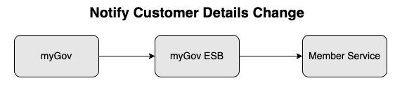
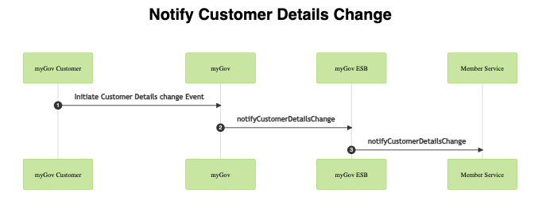
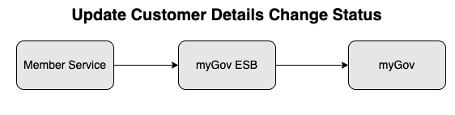
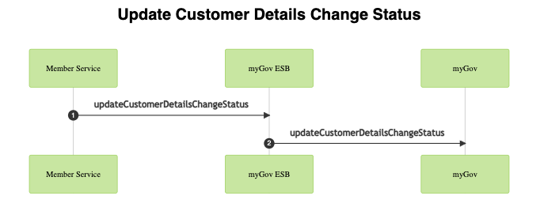
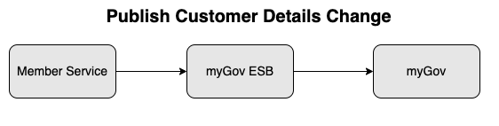
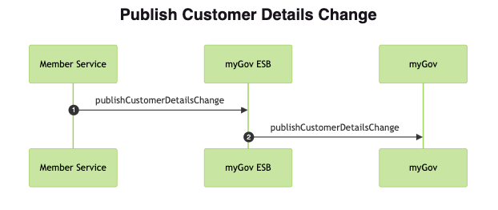

## Overview
The proposed Update Your Details service has been designed to offer an easy to use contact information update service, making it simpler for customers to interact with government when, where and how
it suits them. The proposal is intended to drive and unlock the real benefits of online services for customers and government, and will introduce a shift from the burdensome one-to-one customer
communication with government to a one-to-many communication approach.

### Purpose

The purpose of this specification is to document the behaviour of the Customer Details web services.

The Customer Details web services are used to send Update Your Details transactions from myGov to participating member services and receive statuses of the updates from the participating member services.

### Scope

This document specifies the:

1. Service Description
1. Service Mediation used and supporting values
1. Header structure
1. Transformation details if any

### Out of Scope

Items explicitly not included in the scope of this document include:

1. Non ESB systems
1. Business service implementation details

### Audience

This document is intended for:

| Name                                          | Role                                                                                                |
|:----------------------------------------------|:----------------------------------------------------------------------------------------------------|
| myGov member services                         | Member services that are participating in myGov and intend to use<br/>the Customer Details web services |
| myGov Authentication<br/>Services and application | Developers of the myGov Application and Authentication Services                                     |

### Actors

This document describes various criteria and they are categorised by the
using actors and artefacts.

The actors used in this document are:

| Actor             | Details                                                                                                                            |
|:------------------|:-----------------------------------------------------------------------------------------------------------------------------------|
| member service    | A member of myGov that provides services to consumers. A member<br/>service can act as a web service client or a web service provider. |
| myGov ESB         | Reliance Framework Enterprise Service Bus. Used to manage the client /<br/>server interactions to/ from myGov.                          |
| myGov Application | The myGov Application, incorporating the Update Your Details Hub                                                                   |

## Virtual Services

### VS-01: Notify Customer Details Change Service



#### VS01: Service Details
This web service is used by the myGov Update Your Details service to send the information of the updated customer details to participating linked member services. myGov Profile information (name and date of birth) of the myGov account holder will also be passed as part of the request to participating linked member service(s). The receiving member service(s) will then apply their own business rules to determine if they will accept and apply the update(s).



#### VS01: Operation Details

| Attribute         | Attribute Value                   |
|:------------------|:----------------------------------|
| Operation Name    | notifyCustomerDetailsChange       |
| AGAF Rating       | 3                                 |
| SOAP Version      | 1.2                               |
| Transport         | HTTPS                             |
| Authorised Roles  | N / A                             |
| Authorised Groups | N / A                             |
| Service Provider  | member services                   |
| Service Consumers | myGov                             |
| ESB Instance      | External                          |
| Request Action    | [http://.../notifycustomerdetailschange](http://ns.services.my.gov.au/mygov/customerdetails/memberservice/svc/2016/03/05/notifycustomerdetailschange)         |
| Response Action   | [http://.../notifycustomerdetailschangeresponse](http://ns.services.my.gov.au/mygov/customerdetails/memberservice/svc/2016/03/05/notifycustomerdetailschangeresponse) |
| Authentication    | Signed Security                   |
| SSL Certificate<br/>Type  | Client Authenticated TLS 1.2 (2048 bits) |
| Msg Elements<br/>To Sign  | Timestamp, MessageID, Product, Soap Body, Audit, Subject Id |

#### VS01: Request Elements

| Name                        | Format<br/>Value            | Cardinality | Description                                          |
|:----------------------------|:--------------------------|:------------|:-----------------------------------------------------|
| notifyCustomerDetailsChange | [customerDetailsChangeType](#service-element---customerdetailschangetype)  | [1..1]    |                         |

#### VS01: Response Elements

##### notifyCustomerDetailsChangeResponse

| Name                              | Format<br/>Value         | Cardinality | Description                                                                                                                 |
|:----------------------------------|:-----------------------|:------------|:----------------------------------------------------------------------------------------------------------------------------|
| notifyCustomer<br/>DetailsChangeResult | 'SUCCESS',<br/>'FAILURE'   | [1..1]    | Whether or not the request succeeded.<br/>Note that errors that prevent the <br/>service executing are to be returned as<br/> SOAP Faults |
| serviceMessages                   | [serviceMessages](#common-elements---servicemessagestype) | [0..1]    |  |

### VS-02: Update Customer Details Change Status Service



#### VS-02: Service Details

This web service is used by the member services to send the status of the customer details update to the myGov Update Your Details Service. Once received, the status will be updated in myGov and the customer can view it in the myGov Update Your Details History tab.



#### VS-02: Operation Details

| Attribute         | Attribute Value                   |
|:------------------|:----------------------------------|
| Operation Name    | updateCustomerDetailsChangeStatus |
| AGAF Rating       | 3                                 |
| SOAP Version      | 1.2                               |
| Transport         | HTTPS                             |
| Authorised Roles  | N / A                             |
| Authorised Groups | N / A                             |
| Service Provider  | myGov                             |
| Service Consumers | member services                   |
| ESB Instance      | External                          |
| Request Action    | [http://.../updatecustomerdetailschangestatus](http://ns.services.my.gov.au/customerdetails/virtual/svc/2015/06/13/updatecustomerdetailschangestatus)        |
| Response Action   | [http://.../updatecustomerdetailschangestatusresponse](http://ns.services.my.gov.au/customerdetails/virtual/svc/2015/06/13/updatecustomerdetailschangestatusresponse)|
| Authentication    | Signed Security                   |
| SSL Certificate<br/>Type  | Client Authenticated TLS 1.2 (2048 bits) |
| Msg Elements<br/>To Sign  | Timestamp, MessageID, Product, Soap Body, Audit, Subject Id |

#### VS-02: Request Elements

##### updateCustomerDetailsChangeStatus

| Name                        | Format<br/>Value              | Cardinality | Description                                                                |
|:----------------------------|:----------------------------|:------------|:---------------------------------------------------------------------------|
| customerDetails<br/>ChangeStatus | [customerDetails<br/>ChangeStatus](#updatecustomerdetailschangestatuscustomerdetailschangestatus) | [1..1] | Contains the statuses of the customer details<br/>update at the member service |

##### updateCustomerDetailsChangeStatus.customerDetailsChangeStatus

| Name            | Format<br/>Value | Cardinality | Description                                                                |
|:----------------|:---------------|:------------|:---------------------------------------------------------------------------|
| memberServiceId | String (12)    | [1..1]    | The member service that sent the change<br/>status (MGV, ATO, MCA, CLK etc)  |
| eventId         | Numeric        | [1..1]    | The myGov Event id that was assigned to<br/>the customer details change request that<br/>this change status relates to |
| notification    | [notification](#updatecustomerdetailschangestatuscustomerdetailschangestatusnotification)  | [0..many] | Contains the notification statuses |

##### updateCustomerDetailsChangeStatus.customerDetailsChangeStatus.notification

| Name       | Format<br/>Value              | Cardinality | Description                                                                |
|:-----------|:----------------------------|:------------|:---------------------------------------------------------------------------|
| dataType   | String(5)                   | [1..1]    | The data type code that the status is for.<br/>Refer to [Contact Details Type](#appendix---contact-details-data-types).  |
| status     | [notification-status](#updatecustomerdetailschangestatuscustomerdetailschangestatusnotificationstatus) | [1..1]    | Status details for the data type |

##### updateCustomerDetailsChangeStatus.customerDetailsChangeStatus.notification.status

| Name                 | Format<br/>Value           | Cardinality | Description                                                                |
|:---------------------|:-------------------------|:------------|:---------------------------------------------------------------------------|
| statusTimestamp      | `yyyy-MM-ddTHH:mm:ss.SSSZ` | [1..1]  | The date time that the status occurred<br/>at the member service |
| statusCode           | String (5)               | [1..1]    | The current status of the Customer <br/>Details Change at the member service. <br/>Refer to [Status Codes](#appendix---status-codes) |
| statusReasonCode     | String (6)               | [1..1]    | The code that can be used to specify<br/>additional information regarding the<br/>reason for the status. Refer to <br/>[Reason Codes](#appendix---status-reason-codes)|
| statusReasonText     | String (255)             | [0..1]    | Custom description or reason for the<br/>status. Currently only standard reason<br/>texts are allowed and so this field is<br/>currently used and will be ignored if <br/>provided. |
| statusAlertIndicator | "Y" or "N"               | [1..1]    | Indicates if an alert icon should be<br/>placed next to the status in myGov |

#### VS-02: Response Elements

##### updateCustomerDetailsChangeStatusResponse

| Name                                    | Format<br/>Value                 | Cardinality | Description                                                                |
|:----------------------------------------|:-------------------------------|:------------|:---------------------------------------------------------------------------|
| updateCustomerDetails<br/>ChangeStatusResult |'SUCCESS',<br/>'FAILURE'   | [1..1]  | Whether or not the request succeeded.<br/>Note that errors that prevent the<br/>service executing are to be<br/>returned as SOAP Faults |
| serviceMessages                         | [serviceMessages](#common-elements---servicemessagestype)  | [0..1]  | Contains Information around the<br/>processing of the web service request  |

### VS-03: Publish Customer Details Change Service



#### VS-03: Service Details

This web service is used by the Member Services to send the information of the updated customer details to the myGov Update Your Details Service. Once received, the updated customer details will be passed onto other linked Update Your Details Member Services using the notifyCustomerDetailsChange web service.

The customer's core data (name and date of birth) is passed onto myGov. myGov will then match the customer's core data against the myGov Profile and only pass the Update Your Details request to participating Member Services if the customer's core data and myGov Profile match.



#### VS-03: Operation Details

| Attribute         | Attribute Value                   |
|:------------------|:----------------------------------|
| Operation Name    | publishCustomerDetailsChange      |
| Service Provider  | myGov                             |
| Service Consumers | Member Services                   |
| ESB Instance      | External                          |
| AGAF Rating       | 3                                 |
| SOAP Version      | 1.2                               |
| Transport         | HTTPS                             |
| Authorised Roles  | N / A                             |
| Authorised Groups | N / A                             |
| Request Action    | [http://.../publishCustomerDetailsChange](http://ns.services.my.gov.au/customerdetails/virtual/svc/2016/03/05/publishCustomerDetailsChange)  |
| Response Action   | [http://.../publishCustomerDetailsChangeResponse](http://ns.services.my.gov.au/customerdetails/virtual/svc/2016/03/05/publishCustomerDetailsChangeResponse)  |
| Authentication    | Signed Security                   |
| SSL Certificate<br/>Type  | Client Authenticated TLS 1.2 (2048 bits) |
| Msg Elements<br/>To Sign  | Timestamp, MessageID, Product, Soap Body, Audit, Subject Id |

#### VS-03: Request Elements

| Name                         | Format<br/>Value            | Cardinality | Description        |
|:-----------------------------|:--------------------------|:------------|:-------------------|
| publishCustomerDetailsChange | [CustomerDetailsChangeType](#service-element---customerdetailschangetype) | [1..1]    |  |

#### VS-03: Response Elements

#### publishCustomerDetailsChangeResponse

| Name                               | Format<br/>Value         | Cardinality | Description                            |
|:-----------------------------------|:-----------------------|:------------|:---------------------------------------|
| publishCustomer<br/>DetailsChangeResult |'SUCCESS',<br/>'FAILURE'| [1..1] | Whether or not the request succeeded.<br/>Note that errors that prevent the<br/>service executing are to be returned<br/>as SOAP Faults |
| eventId                            | Numeric                | [1..1]      | The id that is assigned to the customer<br/>details change request and used to<br/>correlate the event across member services. |
| serviceMessages                    | [serviceMessages](#common-elements---servicemessagestype)| [0..1]    | Contains Information around the<br/>processing of the web service<br/>request |

## Appendix

### Common Headers

#### Request Header - WSA Header
| Name    | Format<br/>Value           | Mandatory | Description                                             |
|:--------|:-------------------------|:---------:|:--------------------------------------------------------|
| to      | `http://www.w3.org/2005/08/addressing/anonymous` | No  | WSA Endpoint       |
| messageID | URN:UUID Format        | Yes       | Unique Message ID to identify<br/> an individual message |
| action  | uri                      | Yes       | Value that indicates the<br/> semantics of the message as<br/> well as the service to be called |

#### Custom Header - product
| Name    | Format<br/>Value           | Mandatory | Description                                             |
|:--------|:-------------------------|:---------:|:--------------------------------------------------------|
| organisation   | Refer to <br/>organisation below | Yes | Details of the organisation the request<br/> originated from |
| productName    | string            | Yes | The name of the product or application<br/>as it is known externally |
| productVersion | vx.x (v1.0)       | Yes | Version of the software product |
| platform       | string            | Yes | Platform / operating system that the<br/>product or application runs on |

#### Customer Header - product.organisation
| Name    | Format<br/>Value           | Mandatory | Description                                             |
|:--------|:-------------------------|:---------:|:--------------------------------------------------------|
| qualifier | `http://ns.servcies.my.gov.au/qualifier/organisation` | Yes | The organisation or agency<br/>where the request<br/>originated from |
| id      | string | Yes | The id of the organisation.<br/>To be assigned in conjunction<br/>with myGov |

#### Customer Header - subjectId
| Name    | Format<br/>Value           | Mandatory | Description                                             |
|:--------|:-------------------------|:---------:|:--------------------------------------------------------|
| qualifier | uri | Yes | The uri representing the id type <br/>(e.g. `http://ns.services.my.gov.au/qualifier/memberservice/ato`) |
| id      | string | Yes | myGov or Member Service id |

#### Customer Header - audit
| Name    | Format<br/>Value           | Mandatory | Description                                             |
|:--------|:-------------------------|:---------:|:--------------------------------------------------------|
| user    | Refer to `user` below    |           |                                                         |
| globalSessionKey | `urn:uuid:a8a22f19-67ee-4d5f-8811-99937794f6d1` | Yes | A universally unique <br/>Identifier prepended<br/>with 'urn:uuid' |

#### Customer Header - audit.user
| Name    | Format<br/>Value           | Mandatory | Description                                           |
|:--------|:-------------------------|:---------:|:--------------------------------------------------------|
| userType | "USER" <br/> "APPU" or "STAFF" | Yes | Identifies if the transaction was<br/>triggered by a user or an application |
| userId  | Refer to userId below |  |   |

#### Customer Header - audit.user,userId
| Name    | Format<br/>Value           | Mandatory | Description                                             |
|:--------|:-------------------------|:---------:|:--------------------------------------------------------|
| qualifier | uri | Yes | The uri representing the id type |
| id      | string | Yes | myGov or Member Service id |

#### Custom Header - serviceProvider
| Name    | Format<br/>Value           | Mandatory | Description                                             |
|:--------|:-------------------------|:---------:|:--------------------------------------------------------|
| qualifier | `http://ns.services.my.gov.au/qualifier/memberservice` | Yes | Uri of the service provider id |
| id      | string | Yes | Member Service acronym |

> Note: not used for updateCoreData web service

#### Security - Timestamp
| Name    | Format<br/>Value         | Mandatory | Description                                        |
|:--------|:-------------------------|:---------:|:---------------------------------------------------|
| created | yyyy-MM-ddTHH:mm:ss.SSSZ<br/>(2011-02-23T11:24:20.100Z) | Yes| Message Created Timestamp  |
| expires | yyyy-MM-ddTHH:mm:ss.SSSZ<br/>(2011-02-23T11:24:20.100Z) | No | Message Expiry Timestamp   |

#### Response Header - WSA Header

| Name    | Format<br/>Value         | Mandatory | Description                                             |
|:--------|:-------------------------|:---------:|:--------------------------------------------------------|
| to      | `http://www.w3.org/2005/08/addressing/anonymous` | No  | WSA Endpoint                          |
| messageID | URN:UUID Format        | Yes       | Unique Message ID to identify<br/>an individual message |
| action  | uri                      | Yes       | Value that indicates the<br/>semantics of the response<br/>message|
| relatesTo | URN:UUID Format        | Yes       | Unique ID that is the <br/>MessageID of the request |

### Common Elements

#### Common Elements - serviceMessagesType

| Name       | Format<br/>Value  | Mandatory | Description            |
|:-----------|:-----------|:---:|:----------------------------------|
| highestSeverity | String       | Yes | 'Fatal', 'Error', 'Warning', 'Informational'.<br/>The highest severity of all the<br/>contained service messages |
| serviceMessage  | Refer to <br/>[serviceMessage](#common-elements---servicemessagestype) | Yes | Detailed information on any service message |

#### Common Elements - serviceMessagesType.serviceMessage
| Name       | Format<br/>Value  | Mandatory | Description            |
|:-----------|:-----------|:---:|:----------------------------------|
| code       | String     | Yes | Code related to the message |
| severity   | String     | Yes | 'Fatal', 'Error', 'Warning', 'Informational'.<br/>The severity of the serviceMessage|
| reason     | String     | Yes | The reason for the failure or warning |
| details    | Any        | No  | Any further details         |

### Service Elements

#### Service Element - customerDetailsChangeType

| Name              | Format<br/>Value                   | Element<br/>Used| Cardinality | Description                                         |
|:------------------|:---------------------------------|:------------|:------------|:----------------------------------------------------|
| coreData          | [coreData](#service-element---coredata)  | Yes | [1..1]    | Contains the myGov core<br/>data (profile) information. |
| customerDetails   | [customerDetails](#service-element---customerdetails) | Yes  | [0..1]    | Contains the customer<br/>details being updated |
| additionalDetails | [additionalDetails](#service-element---additionaldetails) | Yes  | [0..1]    | Contains any additional<br/>customer details |
| changeDetails     | [changeDetails](#service-element---changedetails) | Yes   | [1..1]    | Contains the metadata<br/>around the change |

#### Service Element - coreData

| Name   | Format<br/>Value      | Element<br/>Used| Cardinality | Description  |
|:-------|:--------------------|:------------|:------------|:----------------------------------------------------|
| name   | [name](#service-element---coredata-name)  | Yes  | [1..1] | Contains the name information<br/>stored by myGov |
| dob    | date  | Yes | [1..1]    | Contains the date of birth stored by myGov |

#### Service Element - coreData-name

| Name        | Format<br/>Value | Element<br/>Used| Cardinality | Description  |
|:------------|:---------------|:------------|:------------|:--------------------------------------------------------------------|
| FamilyName  | String         | Yes         | [1..1]    | Refer to [FamilyName](#appendix---name---familyname) |
| FullName    | String         | Yes         | [0..1]    | The full name of a person |
| GivenName   | String         | Yes         | [0..many] | Refer to [GivenName](#appendix---name---givenname) |
| GivenName@<br/>SequenceNumber| int    | Yes         | [0..1] | Refer to [GivenName@Seq](#appendix---name---givennamesequencenumber) |
| NameSuffix  | String         | Yes    | [0..many] | Refer to [NameSuffix](#appendix---name---namesuffix) |
| NameSuffix@<br/>SequenceNumber | int  | Yes | [0..1]   | Refer to [NameSuffix@Seq](#appendix---name---namesuffixsequencenumber) |
| NameTitle                 | String    | Yes | [0..many]| Refer to [NameTitle](#appendix---name---nametitle) |
| NameTitle@<br/>SequenceNumber| Int    | Yes | [0..1]   | Refer to [NameTitle@Seq](#appendix---name---nametitlesequencenumber ) |
| UsageType                 | String    | Yes | [0..1]   | Refer to [UsageType](#appendix---name---usagetype) |
| ValidityPeriod            | PeriodType| No  | [0..1]   |  |
| ValidityPeriod<br/>.End   | date      | No  | [0..1]   | End date of the name validity |
| ValidityPeriod<br/>.Start | date      | No  | [0..1]   | Start date of the name validity |

#### Service Element - customerDetails

| Name              | Format <br/>Value                   | Element<br/>Used| Cardinality | Description                                         |
|:------------------|:---------------------------------|:------------|:------------|:----------------------------------------------------|
| dateOfEffect      | yyyy-MM-dd                       | Yes | [1..1] | Date of which the change took effect.<br/> Date may be day the update is being<br/> made or a date in the past.|
| contactDetails    | [contactDetails](#service-element---contactdetails) | Yes | [1..1] | Contains the customer contact details<br/>being updated |

#### Service Element - contactDetails

| Name              | Format<br/>Value                   | Element<br/>Used| Cardinality | Description                                         |
|:------------------|:---------------------------------|:------------|:------------|:----------------------------------------------------|
| addressDetails+    | [addressDetails](#service-element---addressdetails)    | Yes | [0..many] | Contains the customer address<br/>details being updated |
| telephoneDetails  | [telephoneDetails](#service-element---telephonedetails) | Yes | [0..many] | Contains the customer <br/>telephone details being<br/>updated |
| internetDetails   | [internetDetails](#service-element---internetdetails)  | Yes | [0..many] | Contains the customer email<br/>details being updated |

#### Service Element - addressDetails

| Name              | Format<br/>Value                   | Element<br/>Used| Cardinality | Description                                         |
|:------------------|:---------------------------------|:------------|:------------|:----------------------------------------------------|
| address            | [address](#service-element---address)   | Yes  | [1..1]    | Contains the customer address<br/>details being updated. Details<br/>are in AS4590 format.|
| dataAssuranceLevel | Numeric (1)              | No   | [0..1]    | The level of assurance around<br/>the data. When null, then data<br/>assurance level can be taken as 0 |

#### Service Element - address

| Name              | Format<br/>Value      | Element<br/>Used| Cardinality | Description                                     |
|:------------------|:----------------------|:------------|:------------|:----------------------------------------------------|
| LocationGeocode     | String (40) | No  | [0..1] | Refer to [LocationGeocode](#appendix---address---locationgeocode) |
| CountryName         | String (2)  | Yes | [1..1] | Refer to [CountryName](#appendix---address---countryname) |
| DeliveryPoint       | Numeric (8) | No  | [0..1] | Refer to [DeliveryPoint](#appendix---address---deliverypoint) |
| LevelNumber         | String (5)  | No  | [0..1] | Refer to [LevelNumber](#appendix---address---levelnumber) |
| LevelType           | String (2)  | No  | [0..1] | Refer to [LevelType](#appendix---address---leveltype) |
| Line1               | String (40) | Yes | [1..1] | Refer to [Line1](#appendix---address---line1) |
| Line2               | String (40) | Yes | [0..1] | Refer to [Line2](#appendix---address---line2) |
| Line3               | String (40) | No  | [0..1] | Refer to [Line3](#appendix---address---line3) |
| Line4               | String (40) | No  | [0..1] | Refer to [Line4](#appendix---address---line4) |
| LocalityName        | String (40) | Yes | [1..1] | Refer to [LocalityName](#appendix---address---localityname) |
| LocationDescriptor  | String (50) | No  | [0..1] | Refer to [LocationDescriptor](#appendix---address---locationdescriptor) |
| LotNumber           | String (6)  | No  | [0..1] | Refer to [LotNumber](#appendix---address---lotnumber) |
| PostalDeliveryNumber| String (11) | No  | [0..1] | Refer to [PostalDeliveryNumber](#appendix---address---postaldeliverynumber) |
| PostalDeliveryType  | String (11) | No  | [0..1] | Refer to [PostalDeliveryType](#appendix---address---postaldeliverytype) |
| Postcode            | Numeric (4) | Yes | [1..1] | Refer to [Postcode](#appendix---address---postcode) |
| SiteName            | String (50) | No  | [0..1] | Refer to [SiteName](#appendix---address---sitename) |
| StateTerritory      | String (3)  | Yes | [1..1] | Refer to [StateTerritory](#appendix---address---stateterritory) |
| Status              | String (3)  | No  | [0..1] | Refer to [Status](#appendix---address---status) |
| StreetName          | String (45) | No  | [0..1] | Refer to [StreetName](#appendix---address---streetname) |
| StreetNumber1       | String (6)  | No  | [0..1] | Refer to [StreetNumber1](#appendix---address---streetnumber1) |
| StreetNumber2       | String (6)  | No  | [0..1] | Refer to [StreetNumber2](#appendix---address---streetnumber2) |
| StreetSuffix        | String (2)  | No  | [0..1] | Refer to [StreetSuffix](#appendix---address---streetsuffix) |
| StreetType          | String (4)  | No  | [0..1] | Refer to [StreetType](#appendix---address---streettype) |
| SubComplexAddress   | String (100)| No  | [0..1] | Refer to [SubComplexAddress](#appendix---address---subcomplexaddress) |
| Type                | String (3)  | No  | [0..1] | Refer to [Type](#appendix---address---type) |
| UnitNumber          | String (7)  | No  | [0..1] | Refer to [UnitNumber](#appendix---address---unitnumber) |
| UnitType            | String (4)  | No  | [0..1] | Refer to [UnitType](#appendix---address---unittype) |
| Usage               | String (3)  | Yes | [1..1] | Refer to [Usage](#appendix---address---usage) |
| UsagePeriod | [UsagePeriod](#service-element---address-usageperiod)| No | [0..1]| Refer to [UsagePeriod](#appendix---address---usageperiod) |

#### Service Element - address-UsagePeriod

| Name    | Format<br/>Value  | Element<br/>Used| Cardinality | Description                    |
|:--------|:-----------|:-----|:---------|:----------------------------------------------------|
| End     | yyyy-MM-dd | No   | [0..1] | End date of the address |
| Start   | yyyy-MM-dd | No   | [0..1] | Start date of the address " should be the same as<br/>customerDetails.dateOfEffect |

#### Service Element - telephoneDetails

| Name              | Format<br/>Value                   | Element<br/>Used| Cardinality | Description                                         |
|:------------------|:---------------------------------|:------------|:------------|:----------------------------------------------------|
| telephone             | [telephone](#service-element---telephonedetails-telephone)     | Yes | [1..1] | Refer to [telephone](#appendix---telephonedetails---telephone) |
| silentNumberIndicator | 'Y' or 'N'                  | Yes         | [1..1]    | Refer to [silentNumberIndicator](#appendix---telephonedetails---silentnumberindicator) |
| dataAssuranceLevel    | Numeric (1)                 | No          | [0..1]    | Refer to [Assurance Level](#appendix---assurance-levels) |

#### Service Element - telephoneDetails-telephone

| Name                     |Format<br/>Value| Element<br/>Used| Cardinality | Description                                   |
|:-------------------------|:-------------|:------------|:------------|:----------------------------------------------------|
| Area                     | Numeric (2)  | Yes  | [0..1] | [Area](#appendix---telephone---area) |
| Country                  | Numeric (5)  | Yes  | [0..1] | [Country](#appendix---telephone---country) |
| NonStandardFunctionality | String (256) | No   | [0..1] | [NonStandardFunctionality](#appendix---telephone---nonstandardfunctionality) |
| Preference               | Numeric (2)  | No   | [0..1] | [Preference](#appendix---telephone---preference) |
| ServiceLine              | Numeric (2)  | Yes  | [0..1] | [ServiceLine](#appendix---telephone---serviceline) |
| StandardFunctionality    | Numeric (2)  | No   | [0..1] | [StandardFunctionality](#appendix---telephone---standardfunctionality) |
| TelephoneNumber          | String (16)  | Yes  | [1..1] | [TelephoneNumber](#appendix---telephone---telephonenumber) |
| Usage                    | Numeric (2)  | Yes  | [0..1] | [Usage](#appendix---telephone---usage) |

#### Service Element - internetDetails

| Name               | Format<br/>Value          | Element<br/>Used| Cardinality | Description                                         |
|:-------------------|:------------------------|:------------|:------------|:----------------------------------------------------|
| internet           | [internet](#service-element---internetdetails-internet) | Yes | [1..1]    | Refer to [internet](#appendix---internetdetails---internet) |
| dataAssuranceLevel | Numeric (1)             | No  | [0..1]    | [Assurance Level](#appendix---assurance-levels) |

#### Service Element - internetDetails-internet

| Name          | Format<br/>Value  | Element<br/>Used| Cardinality | Description                 |
|:--------------|:--------------|:----|:-------|:-------------------------------------------------|
| EmailAddress  | String (1100) | Yes | [0..1] | Refer to [EmailAddress](#appendix---internet---emailaddress) |
| Preference    |               | No  | [0..1] | Refer to [Preference](#appendix---internet---preference) |
| Usage         | Numeric (2)   | No  | [0..1] | Refer to [Usage](#appendix---internet---usage) |
| VoiceAddress  | String (500)  | No  | [0..1] | Refer to [VoiceAddress](#appendix---internet---voiceaddress) |
| VoiceProduct  | String (256)  | No  | [0..1] | Refer to [VoiceProduct](#appendix---internet---voiceproduct) |
| VoiceProvider | String (200)  | No  | [0..1] | Refer to [VoiceProvider](#appendix---internet---voiceprovider) |
| WebAddress    | String (1100) | No  | [0..1] | Refer to [WebAddress](#appendix---internet---webaddress) |

#### Service Element - additionalDetails

| Name              | Format<br/>Value     | Element<br/>Used| Cardinality | Description    |
|:------------------|:---------------------|:------------|:------------|:-------------------|
| additionalDetail  | AdditionalDetailType | No          | [1..many] | Refer to [additionalDetail](#appendix---additionaldetails---additionaldetail) |

#### Service Element - additionalDetails-additionalDetail

| Name    | Format<br/>Value  | Element<br/>Used| Cardinality | Description                 |
|:--------|:----------------|:------------|:------------|:----------------------------------|
| name    | String(1..40)   | No          | [1..1]    | The name of the additional field    |
| value   | String(1..254)  | No          | [1..1]    | The value for the additional field. |

#### Service Element - additionalDetail-channelType

| Name  | Format<br/>Value | Element<br/>Used| Cardinality | Description               |
|:------|:---------------|:------------|:------------|:--------------------------------|
| name  | channelType | No | [1..1] | [name](#appendix---channeltype---name) |
| value | e.g WEB     | No | [1..1] | [value](#appendix---channeltype---value) |

#### Service Element - changeDetails

| Name    | Format<br/>Value                   | Element<br/>Used| Cardinality | Description                                         |
|:--------|:---------------------------------|:------------|:------------|:----------------------------------------------------|
| sourceMember<br/>ServiceId    | String (12)               | Yes | [1..1] | [sourceMemberServiceId](#appendix---changedetails---sourcememberserviceid)|
| eventId                  | Numeric                   | Yes | [1..1] | [eventId](#appendix---changedetails---eventid)|
| changeTimestamp          | `yyyy-MM-ddTHH:mm:ss.SSSZ`| Yes | [1..1] | [changeTimestamp](#appendix---changedetails---changetimestamp)|
| changeLodgement<br/>Timestamp | `yyyy-MM-ddTHH:mm:ss.SSSZ`| Yes | [1..1] | [changeLodgementTimestamp](#appendix---changedetails---changelodgementtimestamp)|
| assurances               | [assurances](#service-element---changedetails-assurances)| Yes         | [0..1]    |  |

#### Service Element - changeDetails-assurances

| Name                         | Format<br/>Value | Element<br/>Used| Cardinality | Description                     |
|:-----------------------------|:---------------|:------------|:------------|:--------------------------------------|
| provisioning<br/>AssuranceLevel   | Numeric (1) | No  | [0..1] | [Assurance Level](#appendix---assurance-levels)  |
| authentication<br/>AssuranceLevel | Numeric (1) | No  | [0..1] | [Assurance Level](#appendix---assurance-levels)  |

### Appendix - Service Element Description
#### Appendix - Name - FamilyName
A person's name that is either:
- The hereditary or tribal surname of a person's family;
- Acquired by a person in accordance with a due process defined in a State or Territory Act relating to the registration of births, deaths, marriages and changes of name and sex, and for related purposes, such as the ACT Births, Deaths and Marriages Registration or;

Any other name distinguished from a person given name.

#### Appendix - Name - GivenName
A person's name that is either:
- Assigned by a person parents shortly after birth or adoption or other cultural ceremony;
- Acquired by a person in accordance with a due process defined in a State or Territory Act relating to the registration of births, deaths, marriages and changes of name and sex, and for related purposes, such as the ACT Births, Deaths and Marriages Registration Act or;

Attained by a person within the family group or by which that person is socially identified.

#### Appendix - Name - GivenName@SequenceNumber
Given Name sequence number attribute. Valid values: 1 to 9. First Given name sequence number: 1, second given name sequence number: 2, etc

#### Appendix - Name - NameSuffix
**Not stored by myGov and will not be passed on by myGov if populated.**

An affix which follows the element to which it is added. Honours, awards and other denominations that follow a person name, usually as an acronym or abbreviation.

#### Appendix - Name - NameSuffix@SequenceNumber
Name Suffix sequence number attribute. Valid values: 1 to 9.

#### Appendix - Name - NameTitle
A prefix to a person name. An honorific form of address commencing a name, used when addressing a person by name, whether by mail, phone or in person.
This data element may be repeated where more than one name title is associated with a person, eg. Honourable Doctor (Hon Dr).

> Not stored by myGov and will not be passed on by myGov if populated.

#### Appendix - Name - NameTitle@SequenceNumber
Name Title sequence number attribute. Valid values: 1 to 9. First Name Title sequence number: 1, Second Name Title sequence number: 2, etc

#### Appendix - Name - UsageType
The code for the usage type of a person family name and given name that enables to differentiate between the roles of each recorded or interchanged person's name. This data element can be used where the person offers more than one family name and more than one given name.

Also known as (or Aliases) - This data element denotes any other name that a person is also known by, or has been known by in the past. This includes misspelt names or name variations that are to be retained as they have been used to this person. More than one alias name may be recorded for a person.

**Maiden name**: The family name of any party prior to being changed at marriage. Traditionally the term 'Maiden Name' means the family name of a woman before she is married, this was specifically due to the tradition of a woman taking the man's family name at the time of marriage. Now many couples are using hybrid or merged names to reflect the heritage of both parties in the marriage, thus both parties are changing their names at marriage. This should be reflected in the usage of the term 'Maiden Name' as it should now be used for both sexes. The usage of Maiden name should remain consistent for same sex couples, where one or both of the parties change their name at Civil Union.

**New born**: This data element is reserved for the identification of unnamed newborn babies.

**Preferred name**: This data element is to be associated the name by which the person chooses to be identified. Start date and end date can be used in conjunction with this data element (see ValidityPeriod element) to determine when the specific name usage type commenced or ceased to be effective

#### Appendix - Address - LocationGeocode
Contains the geocode location information - *Not currently used*

#### Appendix - Address - CountryName
ISO3166 value for country codes. "AU" for Australia.

#### Appendix - Address - DeliveryPoint
Australia Post's delivery point id
> Not currently used

#### Appendix - Address - LevelNumber
Within a complex, the number of the floor or level of a multi-storey building/sub-complex

#### Appendix - Address - LevelType
AS4819 Level Types. Within a complex, an abbreviation used to distinguish the floor or level of a multi-storey building/sub-complex

#### Appendix - Address - Line1
Free text address line 1. Unstructured address may be repeated up to 4 lines

> NOTE: where this is an overseas address the country name code becomes mandatory).

This is also used for overseas addresses.

> NOTE: Where there is a need to transfer an Australian address that does not conform to the commonly used address format, the unstructured address lines may be used. These data elements should not be used except when it is impossible to use of the other more structured address data elements.

Unstructured address lines, when used, should contain the entire address. myGov will only be using the first 2 address lines.

#### Appendix - Address - Line2
Free text address line 2. *myGov will only be using the first 2 address lines.*

#### Appendix - Address - Line3
Free text address line 3. *myGov will only be using the first 2 address lines.*

#### Appendix - Address - Line4
Free text address line 4. *myGov will only be using the first 2 address lines.*

#### Appendix - Address - LocalityName
The name of the locality/suburb of the address

#### Appendix - Address - LocationDescriptor  
A free text data element to describe the position of the address relative to another physical site.

#### Appendix - Address - LotNumber
The reference number allocated to a property for subdivision administration purposes prior to road numbering. Usage: Where an official Road number has not been assigned, this field may be used for postal purposes as well as the physical identification of an address site. While the word 'LOT' should not appear within this data element, for identification purposes, the word 'LOT' must precede the lot number.

#### Appendix - Address - PostalDeliveryNumber
Identification number for the channel of postal delivery. Usage Examples:

PO BOX C96 (Postal delivery number is C96)

RMB 123 (Postal delivery number is 123)

#### Appendix - Address - PostalDeliveryType  
AS4590 Postal Delivery Types. Identification for the channel of postal delivery. Usage: Used where mail is to be delivered to a box, bag or agent for pick-up by the intended recipient or to the rural mail box number where no other address exists.

#### Appendix - Address - Postcode
The Australian numeric descriptor for a postal delivery area, aligned with locality, suburb or place

#### Appendix - Address - SiteName
The official name or culturally accepted common usage name for an address site, including the name of a building, homestead, building complex, agricultural property, park or unbounded address site.

> Note: names of persons, associations or businesses should not be used as address site names.

#### Appendix - Address - StateTerritory
AS4819 State/ Territory. The State or Territory code of the address

#### Appendix - Address - Status
To identify the category of the address, as officially assigned by an addressing authority authorised by the Jurisdictional State or Territory, or Australia Post for postal type addresses. The examples provided list the recommended values.

Official address (OFF): indicates that the address and its component parts have been formally assigned by the responsible state jurisdiction/s.

Valid alias address (VAL): indicates that the address is an acceptable alias to the official address by the responsible state jurisdiction/s.

Invalid alias address (INV): indicates a non-official address. E.g. a vanity address where a perceived up-market locality name is incorrectly used in place of the officially assigned locality name

Obsolete address (OBS): an address that is no longer valid. For example where there is a change of street name, change of locality or where a RMB address previously used has been replaced by Rural Numbering

Unknown/ Not Stated (UNK): Where the Address Status is not stated or unknown a null entry will be recorded.

#### Appendix - Address - StreetName
Name of the street

#### Appendix - Address - StreetNumber1
Start of Range Number of the street

#### Appendix - Address - StreetNumber2
End of Range Number of the street  

#### Appendix - Address - StreetSuffix
AS4819 Street Suffix Type. The abbreviation code used to represent the suffix of road/ thoroughfare applicable to the address site/ complex

#### Appendix - Address - StreetType
AS4819 Street Type. The abbreviation code used to distinguish the type of road/ thoroughfare applicable to address site/ complex.

#### Appendix - Address - SubComplexAddress
> Not currently used in myGov

#### Appendix - Address - Type
This element is to distinguish between a physical address (geographical place) or virtual address. 'Y', 'N', 'UNK'

#### Appendix - Address - UnitNumber
Number of the apartment

#### Appendix - Address - UnitType
AS4819 Unit Type. Within a complex, an abbreviation used to distinguish the type of an address found within a building/ sub-complex or marina.

#### Appendix - Address - Usage

AS4590 Usage Type Codes.

The role or use of the address in relation to the client. (Can be an Australian address whilst the client is overseas). Examples include:

Primary address (PR) -The property address normally used by the client. (These addresses desirably should have been assigned by a Council)

> NOTE: Where this is the principal place of residence of the client the residential code should be used.

Residential/ Home (RES) -The address of the principal place of residence for the client.

Postal/correspondence (POS) -The address used by the client for receipt of correspondence.-

#### Appendix - Address - UsagePeriod
Usage Period of the address. Start date, end date

#### Appendix - telephoneDetails - telephone
Contains the customer telephone details being updated. Details are in AS4590 format.

#### Appendix - telephoneDetails - silentNumberIndicator
Indicates if the phone number is a silent number or not

#### Appendix - telephone - Area
This element describes a standard Australian Area Code as used in conjunction with telephone and facsimile numbers.

A new Area Code '3' is added to the AS4590 Schema to support Norfolk Island Numbers.

#### Appendix - telephone - Country
This element describes a standard International country code as used in conjunction with landline telephone, mobile telephone and facsimile numbers. International Telecommunication Union - Recommendation E.164 assigned country codes.

#### Appendix - telephone - NonStandardFunctionality
Communication features available through the telephone that is not standard at this time. This data element should be used when 'other' is entered into Telephone Standard Functionality Code.

#### Appendix - telephone - Preference
Indicates if the electronic contact is preferred over other electronic contacts a party may have.

> Not currently used by myGov.

#### Appendix - telephone - ServiceLine
Describes how a telephone service is physically provided to a party.
- '01' - Mobile
- '02' - Landline/ fixed line
- '03' - Pager
- '09' - Unknown

myGov will use '09' (unknown) for the home and work number fields.

Refer to [Usage Codes](#appendix---usage-codes).

#### Appendix - telephone - StandardFunctionality
Well known communication features available through the telephone. A telephone may have multiple standard features.

> Not currently used by myGov.

#### Appendix - telephone - TelephoneNumber
The minimal number that is associated to a unique provision of telephone service as accessed locally through a standard dialling access. The field length is sufficient to enable an extension to be included at the end of a telephone number.

#### Appendix - telephone - Usage
A code that defines the primary usage for an electronic contact.
- '01' - Personal/ Home
- '02' - Business/ Work
- '08' - Other
- '09' - Unknown

myGov will use '09' (unknown) for mobile numbers.

Refer to [Usage Codes](#appendix---usage-codes).

#### Appendix - internetDetails - internet
Contains the customer email address details being updated. Details are in AS4590 format.

#### Appendix - internet - EmailAddress
An electronic mail internet contact address for a party

#### Appendix - internet - Preference
Indicates if the electronic contact is preferred over other electronic contacts a party may have.

> Not currently used by myGov.

#### Appendix - internet - Usage
A code that defines the primary usage for an electronic contact.
- '01' - Personal
- '02' - Business
- '08' - Other
- '09' - Unknown

> Not currently used by myGov.

#### Appendix - internet - VoiceAddress
An address that uniquely identifies an internet voice product user.

> Not currently used by myGov.

#### Appendix - internet - VoiceProduct
The name of the product that an organization provides which enables voice communication over the internet.

> Not currently used by myGov.

#### Appendix - internet - VoiceProvider
The name of an organization that provides a service that enables voice communication over the internet.

> Not currently used by myGov.

#### Appendix - internet - WebAddress
The location of a party's web site on the World Wide Web (Internet). A Uniform Resource Locator (URL) is a compact string representation of the location for a resource that is available via the Internet.

> Not currently used by myGov.

#### Appendix - additionalDetails - additionalDetail
Any additional details about a customer that need to be added to this notification. This element is added to pass future information that becomes available about a customer that need to be passed to the member agencies.

#### Appendix - channelType - name
Name of the additional detail element, channelType

#### Appendix - channelType - value
Channel by which the UYD transaction was received by initiating member service. Please refer to [Channel Type Codes](#appendix---channel-type-codes) for possible values.

#### Appendix - changeDetails - sourceMemberServiceId
The member service that sent the Event. Please refer to [Agency Codes](#appendix---agency-codes) for possible values.

#### Appendix - changeDetails - eventId
The id that is assigned to the customer details change request and used to correlate the event across member services.

#### Appendix - changeDetails - changeTimestamp
The timestamp of when the change was applied in the member service

#### Appendix - changeDetails - changeLodgementTimestamp
The timestamp of when the change was lodged at the member service. May be the same as the changeTimestamp.

#### Appendix - changeDetails - assurances
The authentication and provisioning assurance levels

### Appendix - Error - Message Format

| Element Name | Format      | Sample | Description                      |
|:-------------|:------------|:-------|:---------------------------------|
| Project Name | Alpha       | MEB    | 3 Char represents the project this error belongs to.<br/>E.g. MEB for myGov ESB |
| Severity     | Alpha (1)   | E      | 1 Char represents the severity of the message. It <br/> MUST be from the list below. (<br/>E-> Error,<br/>W -> Warning,<br/>I -> Information) |
| Code         | Numeric (4) | 1001   | 4 Numeric, represents the allocated business error<br/>code for the specific scenario. |

Error codes starting at 0001 are related to web services profile errors. Refer to Reliance Framework Web Services Profile document for the full listing.

Error codes starting at 2001 are generic Reliance Framework (myGov and Member Service) errors and are used across different services. Refer to Reliance Framework Web Services Profile document for the full listing.

Error codes starting at 9001 are service specific error codes and only apply to each of the services contained in this document.

### Appendix - Error Message Codes

### updateCustomerDetailsChangeStatus Service Specific Errors

| Name          | Usage                                                               | Type  | Code       |
|:--------------|:--------------------------------------------------------------------|:------|:-----------|
| member service<br/> not found | member service not known to myGov                                   | ERROR | MGVEBU9001 |
| Invalid EventId               | The EventId is not known to myGov or<br/>is Invalid                     | ERROR | MGVEBU9002 |
| Unknown Status<br/> Code      | The Status Code is not known to myGov                               | ERROR | MGVEBU9003 |
| Unknown Data<br/>Type         | The Data Type is not known to myGov                                 | ERROR | MGVEBU9004 |
| Unknown Reason<br/>Code       | The Reason Code is not known to myGov                               | ERROR | MGVEBU9005 |
| Final Status<br/>Code         | The current status code is in a 'final'<br/>state and cannot be updated | ERROR | MGVEBU9006 |
| Invalid Reason<br/>Code       | Reason code provided cannot be used with<br/>Alert Indicator            | ERROR | MGVEBU9007 |
| Invalid Status<br/>Code       | Status Code supplied can only be used by<br/>myGov                      | ERROR | MGVEBU9008 |

### Appendix - Usage Codes

This table is used for the telephone section of AS4590. The phone number type can only be determined by using a combination of the usage code and the service line. As home and work numbers can be mobile numbers as well, the service line for them will be 'Unknown'.

| Data Type of Telephone | Usage Code | AS4590 Description | Service Line | AS4590 Description |
|:-----------------------|:-----------|:-------------------|:-------------|:-------------------|
| Home                   | 01         | Personal           | 09           | Unknown            |
| Work                   | 02         | Business           | 09           | Unknown            |
| Mobile                 | 09         | Unknown            | 01           | Mobile             |

### Appendix - Status Codes

The descriptions given in this table are for the information of the member services and myGov developers and are intended to be utilised when determining which status code is to be used. The description is not intended to be used for reasonText.

| Status<br/>Code | Status<br/>Description | Long Description                                                                                                | Source                |
|:-----|:----------|:----------------------------------------------------------------------------------------------------------------------------------------|:----------------------|
| APP  | Applied   | The Customer Details Change has been <br/>processed by the member service and applied<br/>to the customer record for the data type.| member service        |
| DISC | Discarded | The Customer Details Change has been<br/>processed by the member service and<br/>has not been applied to the customer<br/>record for the data type. | member service        |
| FAIL | Failed    | The member service was not able to complete<br/>processing of the Customer Details Change<br/>for the data type due to an error.                | myGov /<br/>member service |
| REC  | Received  | The Customer Details Change has been<br/>received by the member service for<br/>the data type. Processing may or<br/>may not have commenced.        | member service        |
| SUB  | Submitted | The Customer Details Change has been<br/>submitted for delivery to the listed<br/>member service.                                               | myGov                 |

### Appendix - Status Reason Codes

This section includes the reason codes, an indication (not normative) of the text that may be displayed for each reason code, and a listing of the status codes for which each reason code can be used.

| Reason<br/>Code | Reason Text                       | Status<br/>Code(s)   |
|:------------|:--------------------------------------|:---------------------|
| RC0000 | N/A. (No Reason Text will be displayed) | All                  |
| RC0001 | This update may require further action. Please check<br/>your myGov Inbox for more information. | APP, DISC            |
| RC0002 | This update cannot be applied. Please check your<br/>myGov Inbox for more information. | DISC, FAIL           |
| RC0003 | This update is awaiting processing.  | REC                  |
| RC0004 | This update was not applied as more recent<br/>information has been provided or this information<br/>was already recorded. | DISC                 |
| RC0005 | This update will be used for your myGov<br/>notification details.                                                      | APP                  |
| RC0006 | Please contact your member service about<br/>this update.                                                              | APP, DISC, FAIL, REC |
| RC0007 | This update requires further action. Please<br/>confirm this update using your member service<br/>online account.          | APP, DISC            |
| RC0008 | This update cannot be applied. Please<br/> your member service to discuss.                                      | DISC, FAIL           |
| RC0009 | Please contact your member service about<br/> this update                                                               | DISC                 |

### Appendix - Contact Details Data Types

- **POS**: Postal Address
- **RES**: Home Address (Residential Address)
- **HOMNO**: Home Number
- **WORNO**: Work Number
- **MOBNO**: Mobile Number
- **EMAIL**: Email address

### Appendix - Assurance Levels

#### Authentication Assurance Level

The authentication assurance level that the customer has authenticated to. The values are in line with NeAF standards. The possible values are

- **2**: User authenticated with myGov username + password
- **3**: User authenticated with myGov username + password + SQA (or UPIN)
- **4**: User authenticated with myGov username + password + OTP (or Voice password) Registered Mobile Device + UPIN

#### Provisioning Assurance Level

The provisioning assurance related to the linked member service record. The possible values are

- **0**: Anonymous myGov Account User walking into an agency shopfront and not presenting with any credential
- **1**: myGov account with Profile
- **2**: myGov Account with Digital Id

#### Data Assurance Level

The level of assurance around the data. The possible values are

- **0**: The data entered is provided as is no further verifications are performed. E.g. User entered phone number and postal or residential address or email address. When null, then data assurance
level can be taken as 0.
- **1**: Data validation is performed on the elements. E.g. Security verification code sent to Mobile Phone or email address and request the user to enter the code to confirm the ownership. Verify
the residential and postal address with Address Standardisation.

### Appendix - Agency Codes

- **AGED**: AgedCare " DSS
- **APDM**: Australia Post Digital Mailbox
- **ATO**: Australian Taxation Office
- **CLK**: Centrelink
- **CSA**: Child Support
- **DCA**: Disability Care Australia (NDIA)
- **DIS**: Department of Industry, Innovation and Science
- **DVA**: Department of Veterans' Affairs
- **EHR**: Electronic Health Record
- **JOBS**: Department of Employment Job Search
- **MCA**: Medicare
- **NPP**: Nanny Pilot Programme " DSS
- **VIC_DHHS**: Department of Human Services, Victoria

### Appendix - Channel Type Codes

#### WEB
Customer authenticating to member service web system using myGov credentials to update their contact details.

#### TELEPHONE
Customer calling member service telephony system to update their contact details. This channel is out of scope for the current release.

#### IN_PERSON
Customer walking into member service customer care centre to update their contact details. This channel is out of scope for the current release.

### Appendix - Terms and Acronyms
This table provides a list of all acronyms and any terms used within this document that will require explanation or expansion

- **AGAF**: Australian Government Authentication Framework
- **AS4590**: A technical standard that supports the exchange of name and address information within and across jurisdictions and organisations
- **AS4819**: A technical standard that supports the exchange of rural and urban address information within and across jurisdictions and organisations
- **ATO**: Australian Tax Office
- **Authentication Assurance Level**: The authentication assurance level that the customer has authenticated to. The values are in line with NeAF standards
- **CLK**: Centrelink
- **Customer**: Client/user of myGov
- **Data Assurance Level**: The level of assurance around the data
- **Date of effect**: The date of change entered by the customer in the myGov Update Your Details service
- **DHS**: Department of Human Services
- **ESB**: Enterprise Service Bus
- **History Tab**: A tab in the myGov Update Your Details service that provides a history of all service transactions made by the customer using
- **Inbox**: The Inbox functionality within myGov.
- **ISO3166**: A standard published by the International Organization for Standardization (ISO) that defines codes for the names of countries, dependent territories, special areas of geographical interest, and their principal subdivisions (e.g., provinces or states)
- **MBUN**: "Meaningless but unique number" " used as an identifier
- **MCA**: Medicare
- **Member service**: A member service that uses myGov for their customers to access online services
- **Message**: A message sent to the myGov Inbox
- **MGV**: myGov
- **myGov Profile**: The myGov Profile consists of a customer's legal name and date of birth as recorded by their linked Profile member service/s. Profile member services currently include Medicare, Centrelink and the Australian Taxation Office
- **NeAF**: National e-Authentication Framework
- **Phone Usage Type**: AS4590 defined phone usage types. A detailed explanation of these types are defined later in this document
- **Reason code**: A code passed between a member service and myGov to identify which piece of reason text is to be displayed to the customer in the Update Your Details service
- **Reason text**: A communication initiated by a member service, and displayed by myGov to the customer, providing details from the member service regarding the reason for the outcome or any action the customer may need to take to complete their update
- **SOAP**: Simple Object Access Protocol. A protocol specification for exchanging structured information in the implementation of web services
- **SOAP Header**: The header section of the SOAP Protocol
- **SOAP Version**: The version of the SOAP Protocol being used
- **SSL**: Secure Socket Layer
- **SSL Certificate**: A certificate issued by certifying authority to secure communication between 2 electronic systems
- **Status update**: The functionality that enables customers to view the current status of their last TuO update by member service and by data item
- **TuO**: Tell us Once
- **Update Your Details (UYD)**: The customer facing name of the Tell us Once service in myGov
- **URI**: Uniform Resource Identifier
- **URL**: Uniform Resource Locator
- **UUID**: Universally Unique Identifier
- **WCAG 2.0**: Web Content Accessibility Guidelines Version 2.0 - Defines how to make Web content more accessible to people with disabilities
- **Web service**: A service offered by an electronic device to another electronic device, communicating with each other via the world wide web

### Appendix - " Samples
Signing of messages is covered in the Web Services Profile document and is not shown in the example below.

#### VS-01: notifyCustomerDetailsChange - Request
// cspell:disable

```xml
<soap12:Envelope 
   xmlns:soap12="http://www.w3.org/2003/05/soap-envelope" 
   xmlns:wsu="http://docs.oasis-open.org/wss/2004/01/oasis-200401-wss-wssecurity-utility-1.0.xsd">
   <soap12:Header 
      xmlns:wsa="http://www.w3.org/2005/08/addressing">
      <wsse:Security 
         xmlns:wsse="http://docs.oasis-open.org/wss/2004/01/oasis-200401-wss-wssecurity-secext-1.0.xsd">
         <wsse:BinarySecurityToken 
            EncodingType="http://docs.oasis-open.org/wss/2004/01/oasis-200401-wss-soap-message-security-1.0#Base64Binary" 
            ValueType="http://docs.oasis-open.org/wss/2004/01/oasis-200401-wss-x509-token-profile-1.0#X509PKIPathv1" 
            wsu:Id="X509-8BD2BF8ECE4C3FCE78146950913722821">MIIEg</wsse:BinarySecurityToken>
         <ds:Signature 
            Id="SIG-8BD2BF8ECE4C3FCE78146950913723327" 
            xmlns:ds="http://www.w3.org/2000/09/xmldsig#">
            <ds:SignedInfo>...</ds:SignedInfo>
            <ds:SignatureValue>tmARd3</ds:SignatureValue>
            <ds:KeyInfo Id="KI-8BD2BF8ECE4C3FCE78146950913722822">...</ds:KeyInfo>
         </ds:Signature>
         <wsu:Timestamp wsu:Id="TS-8BD2BF8ECE4C3FCE78146950913722120">
            <wsu:Created>2016-07-26T04:58:57.220Z</wsu:Created>
            <wsu:Expires>2016-07-26T05:28:57.220Z</wsu:Expires>
         </wsu:Timestamp>
      </wsse:Security>
      <ce20130907:subjectId 
         wsu:Id="id-8BD2BF8ECE4C3FCE78146950893224617" 
         xmlns:ce20130907="http://ns.services.my.gov.au/common/schema/2013/09/07/elements" 
         xmlns:qid20130907="http://ns.services.my.gov.au/common/qualifiedidentifier/schema/2013/09/07">
         <qid20130907:qualifier>http://ns.services.my.gov.au/qualifier/memberservice/dummy</qid20130907:qualifier>
         <qid20130907:id>uuid81f22e43-075c-4d70-aac5-31dbda62d7c7</qid20130907:id>
      </ce20130907:subjectId>
      <ce20130907:audit 
         wsu:Id="id-8BD2BF8ECE4C3FCE78146950893224616" 
         xmlns:ce20130907="http://ns.services.my.gov.au/common/schema/2013/09/07/elements" 
         xmlns:qid20130907="http://ns.services.my.gov.au/common/qualifiedidentifier/schema/2013/09/07">
         <ce20130907:user>
            <ce20130907:userId>
               <qid20130907:qualifier>http://ns.services.my.gov.au/qualifier/memberservice/dummy</qid20130907:qualifier>
               <qid20130907:id>uuid81f22e43-075c-4d70-aac5-31dbda62d7c7</qid20130907:id>
            </ce20130907:userId>
            <ce20130907:userType>USER</ce20130907:userType>
         </ce20130907:user>
         <ce20130907:globalSessionKey>urn:uuid:51847b9e-2e2d-4cf3-9218-327453a33439</ce20130907:globalSessionKey>
      </ce20130907:audit>
      <ce20130907:serviceProvider 
         wsu:Id="id-8BD2BF8ECE4C3FCE78146950893224618" 
         xmlns:ce20130907="http://ns.services.my.gov.au/common/schema/2013/09/07/elements" 
         xmlns:qid20130907="http://ns.services.my.gov.au/common/qualifiedidentifier/schema/2013/09/07">
         <qid20130907:qualifier>http://ns.services.my.gov.au/qualifier/memberservice</qid20130907:qualifier>
         <qid20130907:id>MYGOV</qid20130907:id>
      </ce20130907:serviceProvider>
      <ce20130907:product 
         wsu:Id="id-8BD2BF8ECE4C3FCE78146950893224515" 
         xmlns:ce20130907="http://ns.services.my.gov.au/common/schema/2013/09/07/elements" 
         xmlns:qid20130907="http://ns.services.my.gov.au/common/qualifiedidentifier/schema/2013/09/07">
         <ce20130907:organisation>
            <qid20130907:qualifier>http://ns.services.my.gov.au/qualifier/organisation</qid20130907:qualifier>
            <qid20130907:id>MGV</qid20130907:id>
         </ce20130907:organisation>
         <ce20130907:productName>myGov TUO Application</ce20130907:productName>
         <ce20130907:productVersion>1.1</ce20130907:productVersion>
         <ce20130907:platform>WebSphere Application Server</ce20130907:platform>
      </ce20130907:product>
      <wsa:Action 
         wsu:Id="Id-613d9961-19cc-44ca-96d7-b185cdd84f7e">
            http://ns.services.my.gov.au/customerdetails/memberservice/svc/2016/03/05/notifycustomerdetailschange
         </wsa:Action>
      <wsa:MessageID wsu:Id="Id-63cf03f8-6016-40cb-9f56-64e800039b9f">uuid:a15aaae3-a6eb-4009-b307-d12603128545</wsa:MessageID>
      <wsa:To wsu:Id="Id-448b3f63-08ba-41a1-b231-f13b57fd7978">http://www.w3.org/2005/08/addressing/anonymous</wsa:To>
   </soap12:Header>
   <soap12:Body wsu:Id="id-8BD2BF8ECE4C3FCE78146950893224411">
      <cdmsg20160305:notifyCustomerDetailsChange 
         xmlns:add-cc="urn:xml-gov-au:final:core:Address:2.0" 
         xmlns:as4590cci="urn:xml-gov-au:final:core:Internet:2.0" 
         xmlns:as4590cct="urn:xml-gov-au:final:core:Telephone:2.0" 
         xmlns:cdcore20141025="http://ns.services.my.gov.au/customerdetails/schema/core/2014/10/25" 
         xmlns:cdcore20160305="http://ns.services.my.gov.au/customerdetails/schema/core/2016/03/05" 
         xmlns:cdmsg20141025="http://ns.services.my.gov.au/customerdetails/schema/messages/2014/10/25" 
         xmlns:cdmsg20160305="http://ns.services.my.gov.au/customerdetails/schema/messages/2016/03/05" 
         xmlns:ce20130907="http://ns.services.my.gov.au/common/schema/2013/09/07/elements" 
         xmlns:ce20141025="http://ns.services.my.gov.au/common/schema/2014/10/25/elements" 
         xmlns:per-cc="urn:xml-gov-au:final:core:period:2.0" 
         xmlns:personv2="urn:xml-gov-au:final:core:PersonName:2.0">
         <ce20130907:coreData>
            <ce20130907:name>
               <personv2:FamilyName LanguageIdentifier="EN" LanguageLocaleIdentifier="AU">DOE</personv2:FamilyName>
               <personv2:FullName LanguageIdentifier="EN" LanguageLocaleIdentifier="AU">JOHN DOE</personv2:FullName>
               <personv2:GivenName LanguageIdentifier="EN" LanguageLocaleIdentifier="AU" SequenceNumber="1">JOHN</personv2:GivenName>
               <personv2:UsageType CodeName="LGL">LGL</personv2:UsageType>
            </ce20130907:name>
            <ce20130907:dob>2000-12-25</ce20130907:dob>
         </ce20130907:coreData>
         <cdcore20160305:customerDetails>
            <cdcore20141025:dateOfEffect>2016-07-26</cdcore20141025:dateOfEffect>
            <cdcore20141025:contactDetails>
               <cdcore20141025:addressDetails>
                  <cdcore20141025:address>
                     <add-cc:CountryName>AU</add-cc:CountryName>
                     <add-cc:Line1>CAROLINE CHISHOLM CENTRE</add-cc:Line1>
                     <add-cc:Line2>57 ATHLLON DRIVE</add-cc:Line2>
                     <add-cc:LocalityName>GREENWAY</add-cc:LocalityName>
                     <add-cc:Postcode>2900</add-cc:Postcode>
                     <add-cc:StateTerritory>ACT</add-cc:StateTerritory>
                     <add-cc:Usage>POS</add-cc:Usage>
                     <add-cc:UsagePeriod>
                        <per-cc:End>9999-12-31</per-cc:End>
                        <per-cc:Start>2014-12-10</per-cc:Start>
                     </add-cc:UsagePeriod>
                  </cdcore20141025:address>
                  <ce20141025:dataAssuranceLevel>0</ce20141025:dataAssuranceLevel>
               </cdcore20141025:addressDetails>
               <cdcore20141025:addressDetails>
                  <cdcore20141025:address>
                     <add-cc:CountryName>AU</add-cc:CountryName>
                     <add-cc:Line1>134 REED ST N</add-cc:Line1>
                     <add-cc:LocalityName>GREENWAY</add-cc:LocalityName>
                     <add-cc:Postcode>2900</add-cc:Postcode>
                     <add-cc:StateTerritory>ACT</add-cc:StateTerritory>
                     <add-cc:Usage>RES</add-cc:Usage>
                     <add-cc:UsagePeriod>
                        <per-cc:End>9999-12-31</per-cc:End>
                        <per-cc:Start>2014-12-10</per-cc:Start>
                     </add-cc:UsagePeriod>
                  </cdcore20141025:address>
                  <ce20141025:dataAssuranceLevel>0</ce20141025:dataAssuranceLevel>
               </cdcore20141025:addressDetails>
               <cdcore20141025:telephoneDetails>
                  <cdcore20141025:telephone>
                     <as4590cct:Area>02</as4590cct:Area>
                     <as4590cct:Country>61</as4590cct:Country>
                     <as4590cct:ServiceLine>09</as4590cct:ServiceLine>
                     <as4590cct:TelephoneNumber>61001234</as4590cct:TelephoneNumber>
                     <as4590cct:Usage>01</as4590cct:Usage>
                  </cdcore20141025:telephone>
                  <cdcore20141025:silentNumberIndicator>Y</cdcore20141025:silentNumberIndicator>
                  <ce20141025:dataAssuranceLevel>0</ce20141025:dataAssuranceLevel>
               </cdcore20141025:telephoneDetails>
               <cdcore20141025:telephoneDetails>
                  <cdcore20141025:telephone>
                     <as4590cct:Country>61</as4590cct:Country>
                     <as4590cct:ServiceLine>01</as4590cct:ServiceLine>
                     <as4590cct:TelephoneNumber>0400123456</as4590cct:TelephoneNumber>
                     <as4590cct:Usage>08</as4590cct:Usage>
                  </cdcore20141025:telephone>
                  <cdcore20141025:silentNumberIndicator>N</cdcore20141025:silentNumberIndicator>
                  <ce20141025:dataAssuranceLevel>0</ce20141025:dataAssuranceLevel>
               </cdcore20141025:telephoneDetails>
               <cdcore20141025:internetDetails>
                  <cdcore20141025:internet>
                     <as4590cci:EmailAddress>EXAMPLE@MY.GOV.AU</as4590cci:EmailAddress>
                  </cdcore20141025:internet>
                  <ce20141025:dataAssuranceLevel>0</ce20141025:dataAssuranceLevel>
               </cdcore20141025:internetDetails>
            </cdcore20141025:contactDetails>
         </cdcore20160305:customerDetails>
         <cdcore20160305:additionalDetails>
            <cdcore20160305:additionalDetail>
               <cdcore20160305:name>channelType</cdcore20160305:name>
               <cdcore20160305:value>WEB</cdcore20160305:value>
            </cdcore20160305:additionalDetail>
         </cdcore20160305:additionalDetails>
         <cdcore20160305:changeDetails>
            <cdcore20141025:sourceMemberServiceId>MCA</cdcore20141025:sourceMemberServiceId>
            <cdcore20141025:eventId>2147483647</cdcore20141025:eventId>
            <cdcore20141025:changeTimestamp>2016-07-26T10:10:10.0Z</cdcore20141025:changeTimestamp>
            <cdcore20141025:changeLodgementTimestamp>2016-07-26T10:10:10.0Z</cdcore20141025:changeLodgementTimestamp>
            <cdcore20141025:assurances>
              <ce20141025:provisioningAssuranceLevel>2</ce20141025:provisioningAssuranceLevel>
              <ce20141025:authenticationAssuranceLevel>3</ce20141025:authenticationAssuranceLevel>
            </cdcore20141025:assurances>
         </cdcore20160305:changeDetails>
      </cdmsg20160305:notifyCustomerDetailsChange>
   </soap12:Body>
</soap12:Envelope>

```

#### VS-01: notifyCustomerDetailsChange - Response

```xml
<soap:Envelope 
    xmlns:soap="http://www.w3.org/2003/05/soap-envelope" 
    xmlns:add="http://www.w3.org/2005/08/addressing" 
    xmlns:elem="http://ns.services.my.gov.au/common/schema/2013/09/07/elements" 
    xmlns:ns1="http://ns.services.my.gov.au/customerdetails/schema/messages/2014/10/25" 
    xmlns:ns2="http://ns.services.my.gov.au/customerdetails/schema/core/2014/10/25">
    <soap:Header>
        <add:To> http://www.w3.org/2005/08/addressing/anonymous</add:To>
        <add:MessageID>urn:uuid:675abbc2-87f5-4d67-9841-068b4fmail01</add:MessageID>
        <add:Action> http://ns.services.my.my.gov.au/customerdetails/memberservice/svc/2014/10/25/notifycustomerdetailschangeresponse </add:Action>
        <add:RelatesTo RelationshipType="http://www.w3.org/2005/08/addressing/reply">urn:uuid:b7644a54-9a3a-43d2-afab-7d29b973ece7</add:RelatesTo>
    </soap:Header>
    <soap:Body>
        <ns1:notifyCustomerDetailsChangeResponse>
            <ns1:notifyCustomerDetailsChangeResult>SUCCESS </ns1:notifyCustomerDetailsChangeResult>
        </ns1:notifyCustomerDetailsChangeResponse>
    </soap:Body>
</soap:Envelope>
```

#### VS-02: updateCustomerDetailsChangeStatus - Request

```xml
<soap:Envelope 
    xmlns:soap="http://www.w3.org/2003/05/soap-envelope" 
    xmlns:add="http://www.w3.org/2005/08/addressing" 
    xmlns:oas="http://docs.oasis-open.org/wss/2004/01/oasis-200401-wss-wssecurity-secext-1.0.xsd" 
    xmlns:elem="http://ns.services.my.gov.au/common/schema/2013/09/07/elements" 
    xmlns:ns="http://ns.services.my.gov.au/common/qualifiedidentifier/schema/2013/09/07" 
    xmlns:oas="http://docs.oasis-open.org/wss/2004/01/oasis-200401-wss-wssecurity-utility-1.0.xsd">
    <soap:Header>
        <add:To>http://www.w3.org/2005/08/addressing/anonymous</add:To>
        <add:MessageID>urn:uuid:b7644a54-9a3a-43d2-afab-7d29b973ece8</add:MessageID>
        <add:Action>http://ns.services.my.my.gov.au/customerdetails/memberservice/svc/2015/06/13/updateCustomerDetailsChangeStatus</add:Action>
        <oas:Security/>
        <elem:audit>
            <elem:user>
                <elem:userId>
                    <ns:qualifier>http://ns.servcies.my.gov.au/qualifier/memberservice/ato</ns:qualifier>
                    <ns:id>ato-customer-application</ns:id>
                </elem:userId>
                <elem:userType>APPU</elem:userType>
            </elem:user>
            <elem:globalSessionKey>urn:uuid:52be406d-a24b-4d0d-80eb-83fb331147cd</elem:globalSessionKey>
        </elem:audit>
        <elem:subjectId>
            <ns:qualifier>http://ns.servcies.my.gov.au/qualifier/memberservice/ato</ns:qualifier>
            <ns:id>uuid2edf3864-7b33-401b-96d1-1620fcb831a1</ns:id>
        </elem:subjectId>
        <elem:product>
            <elem:organisation>
                <ns:qualifier>http://ns.servcies.my.gov.au/qualifier/organisation</ns:qualifier>
                <ns:id>ATO</ns:id>
            </elem:organisation>
            <elem:productName> ATO Customer Application</elem:productName>
            <elem:productVersion>1.0</elem:productVersion>
            <elem:platform>WebSphere Application Server</elem:platform>
        </elem:product>
    </soap:Header>
    <soap:Body>
        <tns:updateCustomerDetailsChangeStatus 
            xmlns:core20150613="http://ns.services.my.gov.au/customerdetails/schema/core/2015/06/13" 
            xmlns:tns="http://ns.services.my.gov.au/customerdetails/schema/messages/2015/06/13" 
            xmlns:core20141025="http://ns.services.my.gov.au/customerdetails/schema/core/2015/06/13">
            <tns:customerDetailsChangeStatus>
                <core20150613:memberServiceId>ATO</core20150613:memberServiceId>
                <core20150613:eventId>2147483647</core20150613:eventId>
                <core20150613:notification>
                    <core20150613:dataType>RES</core20150613:dataType>
                    <core20150613:status>
                        <core20150613:statusTimestamp>2015-02-04T20:12:07.058+11:00</core20150613:statusTimestamp>
                        <core20150613:statusCode>APP</core20150613:statusCode>
                        <core20150613:statusReasonCode>RC0001</core20150613:statusReasonCode>
                        <core20150613:statusAlertIndicator>N</core20150613:statusAlertIndicator>
                    </core20150613:status>
                </core20150613:notification>
                <core20150613:notification>
                    <core20150613:dataType>POS</core20150613:dataType>
                    <core20150613:status>
                        <core20150613:statusTimestamp>2015-02-04T20:12:07.058+11:00</core20150613:statusTimestamp>
                        <core20150613:statusCode>FAIL</core20150613:statusCode>
                        <core20150613:statusReasonCode>RC0007</core20150613:statusReasonCode>
                        <core20150613:statusAlertIndicator>Y</core20150613:statusAlertIndicator>
                    </core20150613:status>
                </core20150613:notification>
            </tns:customerDetailsChangeStatus>
        </tns:updateCustomerDetailsChangeStatus>
    </soap:Body>
</soap:Envelope>

```

#### VS-02: updateCustomerDetailsChangeStatus - Response

```xml
<soap:Envelope 
    xmlns:soap="http://www.w3.org/2003/05/soap-envelope" 
    xmlns:add="http://www.w3.org/2005/08/addressing" 
    xmlns:elem="http://ns.services.my.gov.au/common/schema/2013/09/07/elements" 
    xmlns:ns1="http://ns.services.my.gov.au/customerdetails/schema/messages/2015/06/13" 
    xmlns:ns2="http://ns.services.my.gov.au/customerdetails/schema/core/2015/06/13">
    <soap:Header>
        <add:To> http://www.w3.org/2005/08/addressing/anonymous</add:To>
        <add:MessageID>uuid:675abbc2-87f5-4d67-9841-068b4fmail01</add:MessageID>
        <add:Action> http://ns.services.my.my.gov.au/customerdetails/memberservice/svc/2015/06/13/updatecustomerdetailschangestatusresponse </add:Action>
        <add:RelatesTo 
            RelationshipType="http://www.w3.org/2005/08/addressing/reply">
            urn:uuid:b7644a54-9a3a-43d2-afab-7d29b973ece8
        </add:RelatesTo>
    </soap:Header>
    <soap:Body>
        <ns1:updateCustomerDetailsChangeStatusResponse>
          <ns1:updateCustomerDetailsChangeStatusResult>
              SUCCESS
          </ns1:updateCustomerDetailsChangeStatusResult>
        </ns1:updateCustomerDetailsChangeStatusResponse>
    </soap:Body>
</soap:Envelope>

```

#### VS-03: publishCustomerDetailsChange - Request

```xml
<soap12:Envelope 
  xmlns:soap12="http://www.w3.org/2003/05/soap-envelope" 
  xmlns:wsu="http://docs.oasis-open.org/wss/2004/01/oasis-200401-wss-wssecurity-utility-1.0.xsd">
  <soap12:Header xmlns:wsa="http://www.w3.org/2005/08/addressing">
    <wsse:Security 
      xmlns:wsse="http://docs.oasis-open.org/wss/2004/01/oasis-200401-wss-wssecurity-secext-1.0.xsd">
      <wsse:BinarySecurityToken 
        EncodingType="http://docs.oasis-open.org/wss/2004/01/oasis-200401-wss-soap-message-security-1.0#Base64Binary" 
        ValueType="http://docs.oasis-open.org/wss/2004/01/oasis-200401-wss-x509-token-profile-1.0#X509PKIPathv1" 
        wsu:Id="X509-8BD2BF8ECE4C3FCE78146950913722821">MIIEg</wsse:BinarySecurityToken>
      <ds:Signature Id="SIG-8BD2BF8ECE4C3FCE78146950913723327" xmlns:ds="http://www.w3.org/2000/09/xmldsig#">
        <ds:SignedInfo>...</ds:SignedInfo>
        <ds:SignatureValue>tmARd3</ds:SignatureValue>
        <ds:KeyInfo Id="KI-8BD2BF8ECE4C3FCE78146950913722822">...</ds:KeyInfo>
      </ds:Signature>
      <wsu:Timestamp wsu:Id="TS-8BD2BF8ECE4C3FCE78146950913722120">
        <wsu:Created>2016-07-26T04:58:57.220Z</wsu:Created>
        <wsu:Expires>2016-07-26T05:28:57.220Z</wsu:Expires>
      </wsu:Timestamp>
    </wsse:Security>

    <ce20130907:subjectId wsu:Id="id-8BD2BF8ECE4C3FCE78146950893224617" xmlns:ce20130907="http://ns.services.my.gov.au/common/schema/2013/09/07/elements" xmlns:qid20130907="http://ns.services.my.gov.au/common/qualifiedidentifier/schema/2013/09/07">
      <qid20130907:qualifier>http://ns.services.my.gov.au/qualifier/memberservice/dummy</qid20130907:qualifier>
      <qid20130907:id>uuid81f22e43-075c-4d70-aac5-31dbda62d7c7</qid20130907:id>
    </ce20130907:subjectId>

    <ce20130907:audit 
      wsu:Id="id-8BD2BF8ECE4C3FCE78146950893224616" 
      xmlns:ce20130907="http://ns.services.my.gov.au/common/schema/2013/09/07/elements" 
      xmlns:qid20130907="http://ns.services.my.gov.au/common/qualifiedidentifier/schema/2013/09/07">
      <ce20130907:user>
        <ce20130907:userId>
          <qid20130907:qualifier>http://ns.services.my.gov.au/qualifier/memberservice/dummy</qid20130907:qualifier>
          <qid20130907:id>uuid81f22e43-075c-4d70-aac5-31dbda62d7c7</qid20130907:id>
        </ce20130907:userId>
        <ce20130907:userType>USER</ce20130907:userType>
      </ce20130907:user>
      <ce20130907:globalSessionKey>urn:uuid:51847b9e-2e2d-4cf3-9218-327453a33439</ce20130907:globalSessionKey>
    </ce20130907:audit>

    <ce20130907:serviceProvider wsu:Id="id-8BD2BF8ECE4C3FCE78146950893224618" xmlns:ce20130907="http://ns.services.my.gov.au/common/schema/2013/09/07/elements" xmlns:qid20130907="http://ns.services.my.gov.au/common/qualifiedidentifier/schema/2013/09/07">
      <qid20130907:qualifier>http://ns.services.my.gov.au/qualifier/memberservice</qid20130907:qualifier>
      <qid20130907:id>MYGOV</qid20130907:id>
    </ce20130907:serviceProvider>

    <ce20130907:product wsu:Id="id-8BD2BF8ECE4C3FCE78146950893224515" xmlns:ce20130907="http://ns.services.my.gov.au/common/schema/2013/09/07/elements" xmlns:qid20130907="http://ns.services.my.gov.au/common/qualifiedidentifier/schema/2013/09/07">
      <ce20130907:organisation>
        <qid20130907:qualifier>http://ns.services.my.gov.au/qualifier/organisation</qid20130907:qualifier>
        <qid20130907:id>DUMMY Agency</qid20130907:id>
      </ce20130907:organisation>
      <ce20130907:productName>DUMMY Agency App</ce20130907:productName>
      <ce20130907:productVersion>1.0</ce20130907:productVersion>
      <ce20130907:platform>DUMMY Agency Platform</ce20130907:platform>
    </ce20130907:product>

    <wsa:Action wsu:Id="id-8BD2BF8ECE4C3FCE78146950913723226">http://ns.services.my.gov.au/customerdetails/virtual/svc//2016/03/05/publishcustomerdetailschange</wsa:Action>
    <wsa:MessageID wsu:Id="id-8BD2BF8ECE4C3FCE78146950913723225">uuid:f30e68cd-174a-4f44-9aa7-2fa60320322c</wsa:MessageID>
    <wsa:To wsu:Id="id-8BD2BF8ECE4C3FCE78146950913723124">http://services.my.gov.au/pext/customerdetails/publishcustomerdetailschange/virtual/endpoint/2015/06/13</wsa:To>
  </soap12:Header>
  <soap12:Body wsu:Id="id-8BD2BF8ECE4C3FCE78146950893224411">
    <cdmsg20160305:publishCustomerDetailsChange xmlns:add-cc="urn:xml-gov-au:final:core:Address:2.0" xmlns:as4590cci="urn:xml-gov-au:final:core:Internet:2.0" xmlns:as4590cct="urn:xml-gov-au:final:core:Telephone:2.0" xmlns:cdcore20141025="http://ns.services.my.gov.au/customerdetails/schema/core/2014/10/25" xmlns:cdcore20160305="http://ns.services.my.gov.au/customerdetails/schema/core/2016/03/05" xmlns:cdmsg20141025="http://ns.services.my.gov.au/customerdetails/schema/messages/2014/10/25" xmlns:cdmsg20160305="http://ns.services.my.gov.au/customerdetails/schema/messages/2016/03/05" xmlns:ce20130907="http://ns.services.my.gov.au/common/schema/2013/09/07/elements" xmlns:ce20141025="http://ns.services.my.gov.au/common/schema/2014/10/25/elements" xmlns:per-cc="urn:xml-gov-au:final:core:period:2.0" xmlns:personv2="urn:xml-gov-au:final:core:PersonName:2.0">
      <ce20130907:coreData>
        <ce20130907:name>
          <personv2:FamilyName LanguageIdentifier="EN" LanguageLocaleIdentifier="AU">DOE</personv2:FamilyName>
          <personv2:FullName LanguageIdentifier="EN" LanguageLocaleIdentifier="AU">JOHN DOE</personv2:FullName>
          <personv2:GivenName LanguageIdentifier="EN" LanguageLocaleIdentifier="AU" SequenceNumber="1">JOHN</personv2:GivenName>
          <personv2:UsageType CodeName="LGL">LGL</personv2:UsageType>
        </ce20130907:name>
        <ce20130907:dob>2000-12-25</ce20130907:dob>
      </ce20130907:coreData>
      <cdcore20160305:customerDetails>
        <cdcore20141025:dateOfEffect>2016-07-26</cdcore20141025:dateOfEffect>
        <cdcore20141025:contactDetails>
          <cdcore20141025:internetDetails>
            <cdcore20141025:internet>
              <as4590cci:EmailAddress>EXAMPLE@MY.GOV.AU</as4590cci:EmailAddress>
            </cdcore20141025:internet>
            <ce20141025:dataAssuranceLevel>0</ce20141025:dataAssuranceLevel>
          </cdcore20141025:internetDetails>
        </cdcore20141025:contactDetails>
      </cdcore20160305:customerDetails>
      <cdcore20160305:additionalDetails>
        <cdcore20160305:additionalDetail>
          <cdcore20160305:name>channelType</cdcore20160305:name>
          <cdcore20160305:value>WEB</cdcore20160305:value>
        </cdcore20160305:additionalDetail>
      </cdcore20160305:additionalDetails>
      <cdcore20160305:changeDetails>
        <cdcore20141025:sourceMemberServiceId>MCA</cdcore20141025:sourceMemberServiceId>
        <cdcore20141025:eventId>2147483647</cdcore20141025:eventId>
        <cdcore20141025:changeTimestamp>2016-07-26T10:10:10.0Z</cdcore20141025:changeTimestamp>
        <cdcore20141025:changeLodgementTimestamp>2016-07-26T10:10:10.0Z</cdcore20141025:changeLodgementTimestamp>
        <cdcore20141025:assurances>
          <ce20141025:provisioningAssuranceLevel>2</ce20141025:provisioningAssuranceLevel>
          <ce20141025:authenticationAssuranceLevel>3</ce20141025:authenticationAssuranceLevel>
        </cdcore20141025:assurances>
      </cdcore20160305:changeDetails>
    </cdmsg20160305:publishCustomerDetailsChange>
  </soap12:Body>
</soap12:Envelope>

```

#### VS-03: publishCustomerDetailsChange - Response

```xml
<soap12:Envelope 
  xmlns:soap12="http://www.w3.org/2003/05/soap-envelope" 
  xmlns:wsu="http://docs.oasis-open.org/wss/2004/01/oasis-200401-wss-wssecurity-utility-1.0.xsd">
  <soap12:Header 
    xmlns:wsse="http://docs.oasis-open.org/wss/2004/01/oasis-200401-wss-wssecurity-secext-1.0.xsd" 
    xmlns:ce20130907="http://ns.services.my.gov.au/common/schema/2013/09/07/elements"    xmlns:qid20130907="http://ns.services.my.gov.au/common/qualifiedidentifier/schema/2013/09/07" 
    xmlns:wsa="http://www.w3.org/2005/08/addressing">
    <wsse:Security>
      <wsse:BinarySecurityToken EncodingType="http://docs.oasis-open.org/wss/2004/01/oasis-200401-wss-soap-message-security-1.0#Base64Binary" ValueType="http://docs.oasis-open.org/wss/2004/01/oasis-200401-wss-x509-token-profile-1.0#X509PKIPathv1" wsu:Id="X509-8BD2BF8ECE4C3FCE78146951116578286">ZyiOe</wsse:BinarySecurityToken>
      <ds:Signature Id="SIG-8BD2BF8ECE4C3FCE78146951116578489" xmlns:ds="http://www.w3.org/2000/09/xmldsig#">
        <ds:SignedInfo>...</ds:SignedInfo>
        <ds:SignatureValue>NExX</ds:SignatureValue>
        <ds:KeyInfo Id="KI-8BD2BF8ECE4C3FCE78146951116578287">...</wsse:SecurityTokenReference>
        </ds:KeyInfo>
      </ds:Signature>
      <wsu:Timestamp wsu:Id="TS-8BD2BF8ECE4C3FCE78146951116577685">
        <wsu:Created>2016-07-26T05:32:45.776Z</wsu:Created>
        <wsu:Expires>2016-07-26T06:02:45.776Z</wsu:Expires>
      </wsu:Timestamp>
    </wsse:Security>
    <wsa:RelatesTo RelationshipType="http://www.w3.org/2005/08/addressing/reply" wsu:Id="id-8BD2BF8ECE4C3FCE78146951113390483">uuid:f30e68cd-174a-4f44-9aa7-2fa60320322c</wsa:RelatesTo>
    <wsa:To wsu:Id="id-8BD2BF8ECE4C3FCE78146951099703965">http://www.w3.org/2005/08/addressing/anonymous</wsa:To>
    <wsa:MessageID wsu:Id="id-8BD2BF8ECE4C3FCE78146951099703863">uuid:f30e68cd-174a-4f44-9aa7-2fa60320322b</wsa:MessageID>
    <wsa:Action wsu:Id="id-8BD2BF8ECE4C3FCE78146951099703864">http://ns.services.my.gov.au/customerdetails/virtual/svc//2016/03/05/publishcustomerdetailschangeresponse</wsa:Action>
    <ce20130907:product wsu:Id="id-8BD2BF8ECE4C3FCE78146951095088657">
      <ce20130907:organisation>
        <qid20130907:qualifier>http://ns.services.my.gov.au/qualifier/organisation</qid20130907:qualifier>
        <qid20130907:id>MyGov</qid20130907:id>
      </ce20130907:organisation>
      <ce20130907:productName>MyGovESB</ce20130907:productName>
      <ce20130907:productVersion>1.0</ce20130907:productVersion>
      <ce20130907:platform>DataPower</ce20130907:platform>
    </ce20130907:product>
  </soap12:Header>
  <soap12:Body wsu:Id="id-8BD2BF8ECE4C3FCE78146951095088556" xmlns:cdcore20141025="http://ns.services.my.gov.au/customerdetails/schema/core/2014/10/25" xmlns:cdmsg20160305="http://ns.services.my.gov.au/customerdetails/schema/messages/2016/03/05">
    <cdmsg20160305:publishCustomerDetailsChangeResponse>
      <cdcore20141025:publishCustomerDetailsChangeResult>SUCCESS</cdcore20141025:publishCustomerDetailsChangeResult>
      <cdmsg20160305:eventId>2147483647</cdmsg20160305:eventId>
    </cdmsg20160305:publishCustomerDetailsChangeResponse>
  </soap12:Body>
</soap12:Envelope> 
```

// cspell:enable

### Appendix E - Changelog

#### [1.0] 2016-02-04
**Added**: Document sign-off

#### [1.1] 2016-02-23
**Added**:
1. New section for documenting assurance levels
1. Review comments from Department of Employment

#### [2.0] 2016-03-02
ICT National Manager Approval

#### [2.1] 2016-07-06
**Added**:
1. Adding Phase IV Changes

#### [2.2] 2016-07-26
**Updated**:
1. Addressing review comments from initial tech review

#### [2.3] 2016-09-21
**Added**:
   1. channelType

**Updated**:
   1. Samples with 4 existing and 1 new fields
      - Existing Fields:
         1. authenticationAssuranceLevel
         1. provisioningAssuranceLevel
         1. dataAssuranceLevel
         1. sourceMemberService
      - New Field:
         1. channelType
